# Llista

## NIVELL 1 — BÀSIC (iniciació)

> > Objectiu: entrada, sortida i operacions simples

- Llegir un número i mostrar-lo
- Sumar dos números
- Calcular l’àrea d’un rectangle
- Convertir graus Celsius a Fahrenheit
- Calcular el doble i el triple d’un número
- Intercanviar el valor de dues variables
- Calcular la mitjana de 3 números
- Mostrar el nombre anterior i posterior
- Convertir minuts a hores i minuts
- Calcular el perímetre d’un cercle (donat el radi)

## NIVELL 2 — CONDICIONALS

> > Objectiu: prendre decisions (if / else)

- Saber si un número és positiu o negatiu
- Determinar si un número és parell o senar
- Trobar el número més gran entre dos
- Trobar el màxim de tres números
- Determinar si una persona és major d’edat
- Calcular el preu amb descompte
- Classificar una nota (aprovat, suspens, etc.)
- Saber si un any és de traspàs
- Determinar si un número està dins d’un interval
- Simular un menú simple (opció 1, 2, 3)

## NIVELL 3 — BUCLES (loops)

> > Objectiu: repetir accions

- Mostrar números del 1 al 10
- Mostrar números del 10 al 1
- Sumar els primers N números
- Calcular el factorial d’un número
- Mostrar la taula de multiplicar d’un número
- Comptar quants números parells hi ha fins a N
- Llegir números fins que l’usuari entri 0
- Calcular la mitjana de N números
- Trobar el número més gran d’un conjunt
- Sumar només números positius introduïts per l’usuari

## NIVELL 4 — BUCLES + CONDICIONS

> > Objectiu: combinar decisions i repeticions

- Mostrar només números parells entre 1 i N
- Contar quants números són negatius
- Calcular la suma de números múltiples de 3
- Validar una contrasenya (fins encertar-la)
- Joc d’endevinar un número
- Sumar números fins superar un límit
- Mostrar divisors d’un número
- Comprovar si un número és primer
- Generar la sèrie de Fibonacci
- Convertir un número en base decimal a binari

## NIVELL 5 — ARRAYS / VECTORs

> > Objectiu: treballar amb col·leccions de dades

- Llegir un array de N números
- Mostrar els elements d’un array
- Sumar tots els elements
- Trobar el valor màxim
- Trobar el valor mínim
- Calcular la mitjana
- Comptar quants elements són parells
- Buscar un element dins l’array
- Invertir un array
- Ordenar un array (bubble sort)

## NIVELL 6 — ARRAYS AVANÇATS

> > Objectiu: manipulació més complexa

- Eliminar elements duplicats
- Fusionar dos arrays
- Trobar el segon valor més gran
- Comptar freqüències d’elements
- Rotar un array
- Buscar amb cerca binària
- Separar parells i senars en dos arrays
- Comparar dos arrays
- Ordenació per selecció
- Ordenació per inserció

## NIVELL 7 — MATRIUS (2D)

> > Objectiu: treballar amb taules

- Llegir una matriu
- Mostrar una matriu
- Sumar tots els elements
- Sumar cada fila
- Sumar cada columna
- Trobar el valor màxim
- Transposar una matriu
- Multiplicar dues matrius
- Comprovar si és matriu identitat
- Diagonal principal i secundària

## NIVELL 8 — PROBLEMES AVANÇATS

> > Objectiu: lògica complexa

- Validar si un número és palíndrom
- Comprovar si una paraula és palíndroma
- Simular un caixer automàtic
- Gestió d’una llista de notes
- Sistema de votacions
- Ordenar per múltiples criteris
- Simular una cua (queue)
- Simular una pila (stack)
- Comptar paraules en una frase
- Algorisme d’Euclides (MCD)

## NIVELL 9 — RECURSIVITAT

> > Objectiu: pensar recursivament

- Factorial recursiu
- Fibonacci recursiu
- Suma de dígits
- Potència recursiva
- Recórrer un array recursivament
- Torres de Hanoi
- Cerca binària recursiva
- Invertir cadena recursivament
- Combinacions simples
- Backtracking bàsic

## NIVELL 10 — NIVELL ALT (pensament algorísmic)

> > Objectiu: problemes reals

- Algorismes de camins (BFS/DFS)
- Dijkstra (camí mínim)
- Problema de la motxilla
- N-reines
- Sudoku (resolució)
- Planificació de tasques
- Simulació de trànsit
- Sistema de recomanació simple
- Compressió simple (Run-Length Encoding)
- Separació de problemes amb divide & conquer

# Exercicis algorismica

## Nivell 1 — Exercicis d’Algorísmica

### Exercici 1: Llegir un número i mostrar-lo

#### Enunciat

Fer un programa que llegeixi un número i el mostri per pantalla.

#### Pseudocodi

```
INICI
   LLEGIR numero
   ESCRIURE numero
FI
```

#### Diagrama de flux

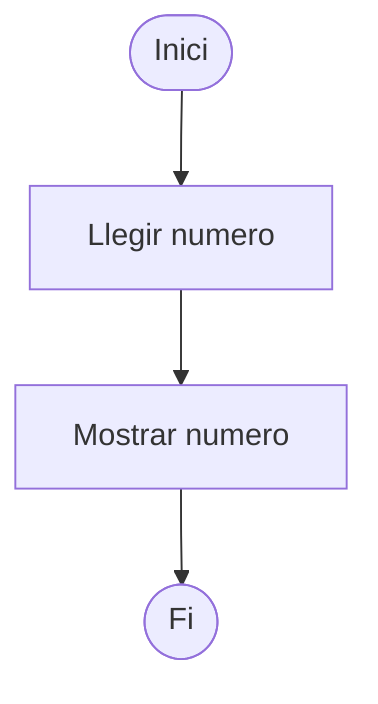
```mermaid
flowchart TD
  A([Inici]) --> B[Llegir numero]
  B --> C[Mostrar numero]
  C --> D([Fi])
```

### Exercici 2: Sumar dos números

#### Enunciat

Fer un programa que llegeixi dos números i mostri la seva suma.

#### Pseudocodi

```
INICI
   LLEGIR num1
   LLEGIR num2
   suma ← num1 + num2
   ESCRIURE suma
FI
```

#### Diagrama de flux

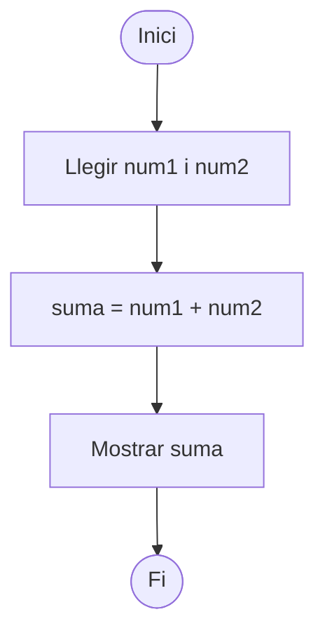
```mermaid
flowchart TD
  A([Inici]) --> B[Llegir num1 i num2]
  B --> C[suma = num1 + num2]
  C --> D[Mostrar suma]
  D --> E([Fi])
```

### Exercici 3: Àrea d’un rectangle

#### Enunciat

Calcular l’àrea d’un rectangle donats la base i l’altura.

#### Pseudocodi

```
INICI
   LLEGIR base
   LLEGIR altura
   area ← base \* altura
   ESCRIURE area
 FI
```

#### Diagrama de flux

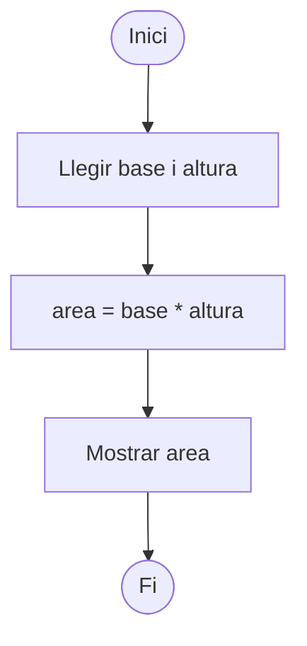
```mermaid
flowchart TD
  A([Inici]) --> B[Llegir base i altura]
  B --> C[area = base * altura]
  C --> D[Mostrar area]
  D --> E([Fi])
```

### Exercici 4: Celsius a Fahrenheit

#### Enunciat

Convertir una temperatura de graus Celsius a Fahrenheit.

#### Pseudocodi

```
INICI
   LLEGIR celsius
   fahrenheit ← celsius \* 9 / 5 + 32
   ESCRIURE fahrenheit
FI
```

#### Diagrama de flux

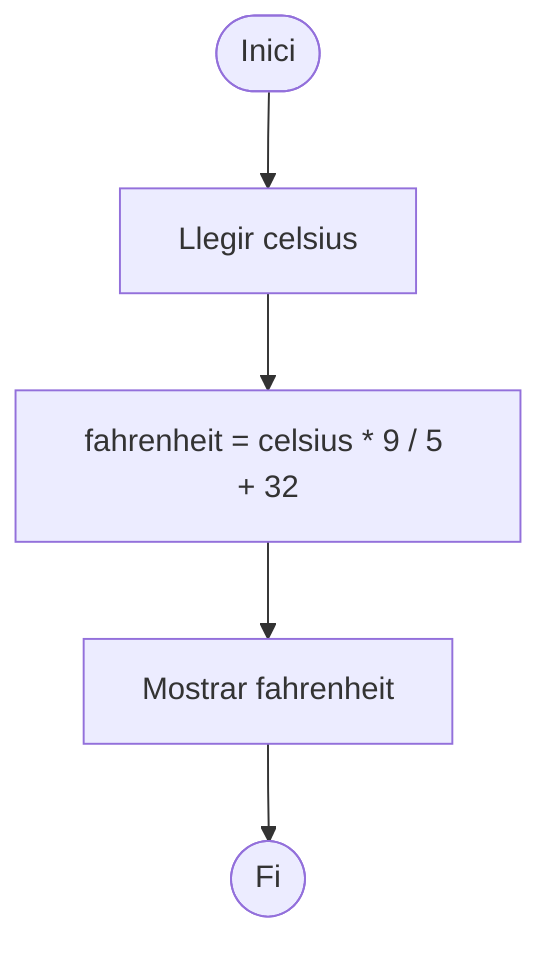
```mermaid
flowchart TD
  A([Inici]) --> B[Llegir celsius]
  B --> C[fahrenheit = celsius * 9 / 5 + 32]
  C --> D[Mostrar fahrenheit]
  D --> E([Fi])
```

### Exercici 5: Doble i triple

#### Enunciat

Donat un número, calcular el seu doble i el seu triple.

#### Pseudocodi

```
INICI
   LLEGIR numero
   doble ← numero _ 2
   triple ← numero _ 3
   ESCRIURE doble
   ESCRIURE triple
 FI
```

#### Diagrama de flux

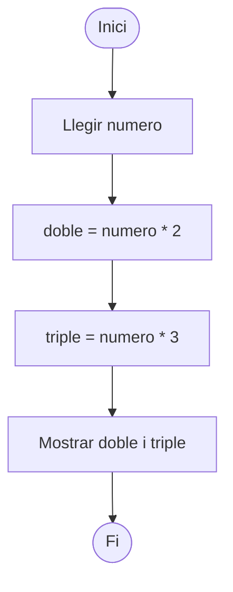
```mermaid
flowchart TD
  A([Inici]) --> B[Llegir numero]
  B --> C[doble = numero * 2]
  C --> D[triple = numero * 3]
  D --> E[Mostrar doble i triple]
  E --> F([Fi])
```

### Exercici 6: Intercanviar valors

#### Enunciat

Intercanviar els valors de dues variables.

#### Pseudocodi

```
INICI
   LLEGIR a
   LLEGIR b
   temp ← a
   a ← b
   b ← temp
   ESCRIURE a, b
FI
```

#### Diagrama de flux

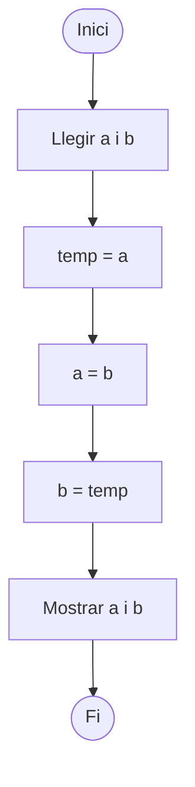
```mermaid
flowchart TD
  A([Inici]) --> B[Llegir a i b]
  B --> C[temp = a]
  C --> D[a = b]
  D --> E[b = temp]
  E --> F[Mostrar a i b]
  F --> G([Fi])
```

### Exercici 7: Mitjana de 3 números

#### Enunciat

Calcular la mitjana de tres números.

#### Pseudocodi

```
INICI
   LLEGIR n1
   LLEGIR n2
   LLEGIR n3
   mitjana ← (n1 + n2 + n3) / 3
   ESCRIURE mitjana
FI
```

#### Diagrama de flux

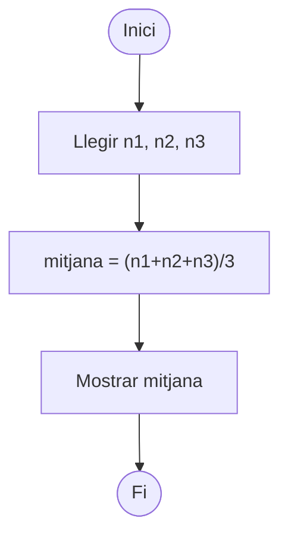
```mermaid
flowchart TD
  A([Inici]) --> B[Llegir n1, n2, n3]
  B --> C["mitjana = (n1+n2+n3)/3"]
  C --> D[Mostrar mitjana]
  D --> E([Fi])
```

### Exercici 8: Anterior i posterior

#### Enunciat

Donat un número, mostrar el seu anterior i posterior.

#### Pseudocodi

```
INICI
   LLEGIR numero
   anterior ← numero - 1
   posterior ← numero + 1
   ESCRIURE anterior
   ESCRIURE posterior
FI
```

#### Diagrama de flux

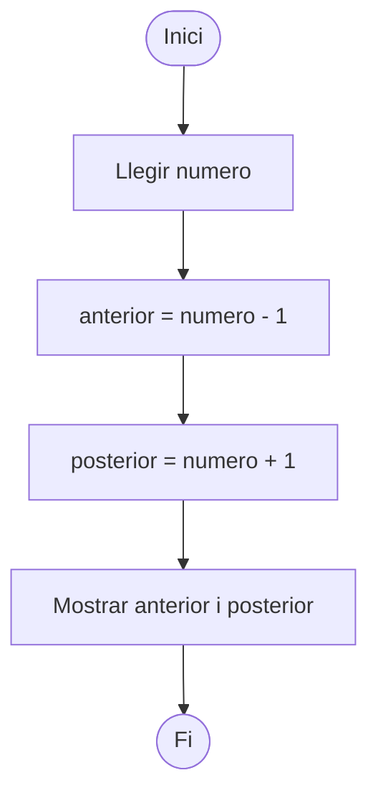
```mermaid
flowchart TD
  A([Inici]) --> B[Llegir numero]
  B --> C[anterior = numero - 1]
  C --> D[posterior = numero + 1]
  D --> E[Mostrar anterior i posterior]
  E --> F([Fi])
```

### Exercici 9: Minuts a hores

#### Enunciat

Convertir un nombre de minuts en hores i minuts.

#### Pseudocodi

```
INICI
   LLEGIR minuts
   hores ← minuts DIV 60
   minuts_restants ← minuts MOD 60
   ESCRIURE hores
   ESCRIURE minuts_restants
FI
```

#### Diagrama de flux

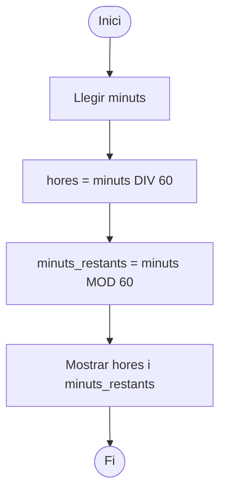
```mermaid
flowchart TD
  A([Inici]) --> B[Llegir minuts]
  B --> C[hores = minuts DIV 60]
  C --> D[minuts_restants = minuts MOD 60]
  D --> E[Mostrar hores i minuts_restants]
  E --> F([Fi])
```

### Exercici 10: Perímetre d’un cercle

#### Enunciat

Calcular el perímetre d’un cercle a partir del radi.

#### Pseudocodi

```
INICI
   LLEGIR radi
   perimetre ← 2 * 3.1416 * radi
FI
```

#### Diagrama de flux

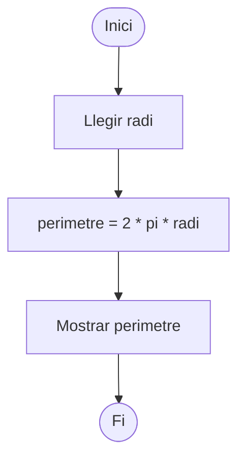
```mermaid
flowchart TD
  A([Inici]) --> B[Llegir radi]
  B --> C[perimetre = 2 * pi * radi]
  C --> D[Mostrar perimetre]
  D --> E([Fi])
```

## Nivell 2 — Exercicis d’Algorísmica (Condicionals)

### Exercici 11: Positiu o negatiu

#### Enunciat

Fer un programa que determini si un número és positiu o negatiu.

#### Pseudocodi

```
INICI
   LLEGIR numero
   SI numero >= 0 ALESHORES
      ESCRIURE "Positiu"
   SINO
      ESCRIURE "Negatiu"
FI
```

#### Diagrama de flux

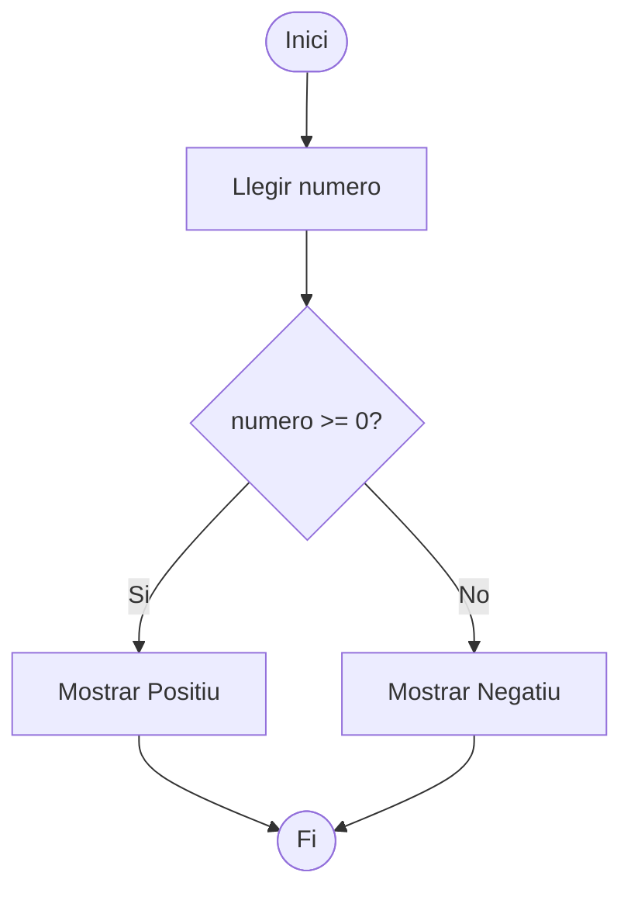
```mermaid
flowchart TD
  A([Inici]) --> B[Llegir numero]
  B --> C{numero >= 0?}
  C -->|Si| D[Mostrar Positiu]
  C -->|No| E[Mostrar Negatiu]
  D --> F([Fi])
  E --> F
```

### Exercici 12: Parell o senar

#### Enunciat

Determinar si un número és parell o senar.

#### Pseudocodi

```

INICI
   LLEGIR numero
   SI numero MOD 2 = 0 ALESHORES
      ESCRIURE "Parell"
   SINO
      ESCRIURE "Senar"
FI
```

#### Diagrama de flux

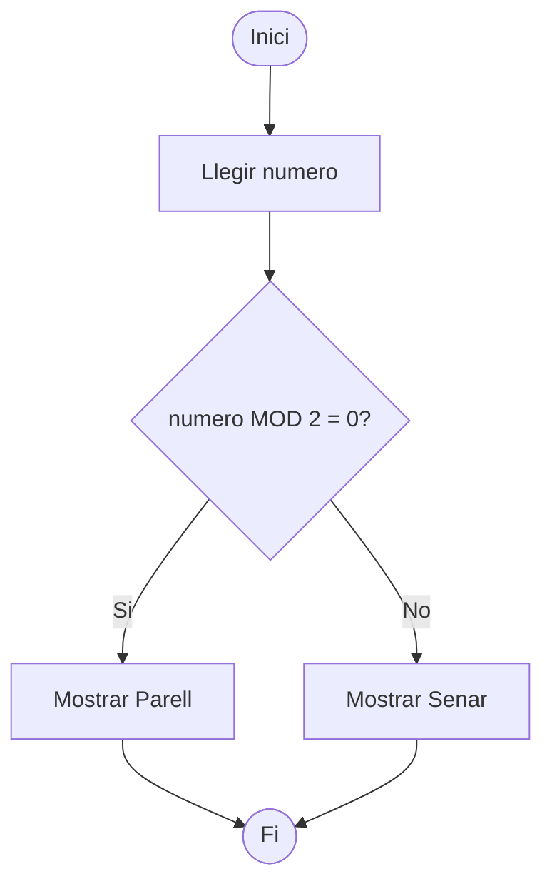
```mermaid
flowchart TD
  A([Inici]) --> B[Llegir numero]
  B --> C{numero MOD 2 = 0?}
  C -->|Si| D[Mostrar Parell]
  C -->|No| E[Mostrar Senar]
  D --> F([Fi])
  E --> F
```

### Exercici 13: Número més gran (2)

#### Enunciat

Trobar el número més gran entre dos números.

#### Pseudocodi

```
INICI
   LLEGIR a
   LLEGIR b
   SI a > b ALESHORES
      ESCRIURE a
   SINO
      ESCRIURE b
FI
```

#### Diagrama de flux

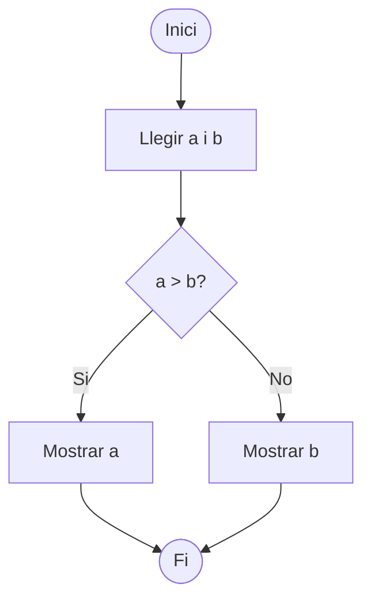
```mermaid
flowchart TD
  A([Inici]) --> B[Llegir a i b]
  B --> C{a > b?}
  C -->|Si| D[Mostrar a]
  C -->|No| E[Mostrar b]
  D --> F([Fi])
  E --> F
```

### Exercici 14: Màxim de tres números

#### Enunciat

Trobar el número més gran entre tres números.

#### Pseudocodi

```
INICI
   LLEGIR a, b, c
   major ← a
   SI b > major ALESHORES
      major ← b
      FI
   SI c > major ALESHORES
      major ← c
      FI
   ESCRIURE major
FI
```

#### Diagrama de flux

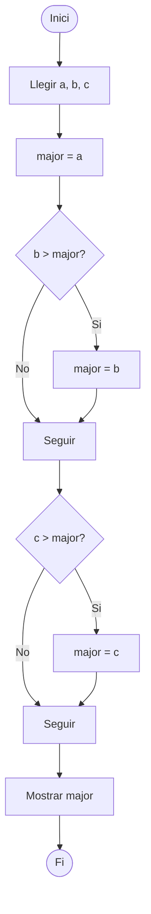
```mermaid
flowchart TD
A([Inici]) --> B[Llegir a, b, c]
  B --> C[major = a]
  C --> D{b > major?}
  D -->|Si| E[major = b]
  D -->|No| F[Seguir]
  E --> F
  F --> G{c > major?}
  G -->|Si| H[major = c]
  G -->|No| I[Seguir]
  H --> I
  I --> J[Mostrar major]
  J --> K([Fi])
```

### Exercici 15: Major d’edat

#### Enunciat

Determinar si una persona és major d’edat (18 o més anys).

#### Pseudocodi

```
INICI
   LLEGIR edat
   SI edat >= 18 ALESHORES
      ESCRIURE "Major d'edat"
   SINO
      ESCRIURE "Menor d'edat"
FI
```

#### Diagrama de flux

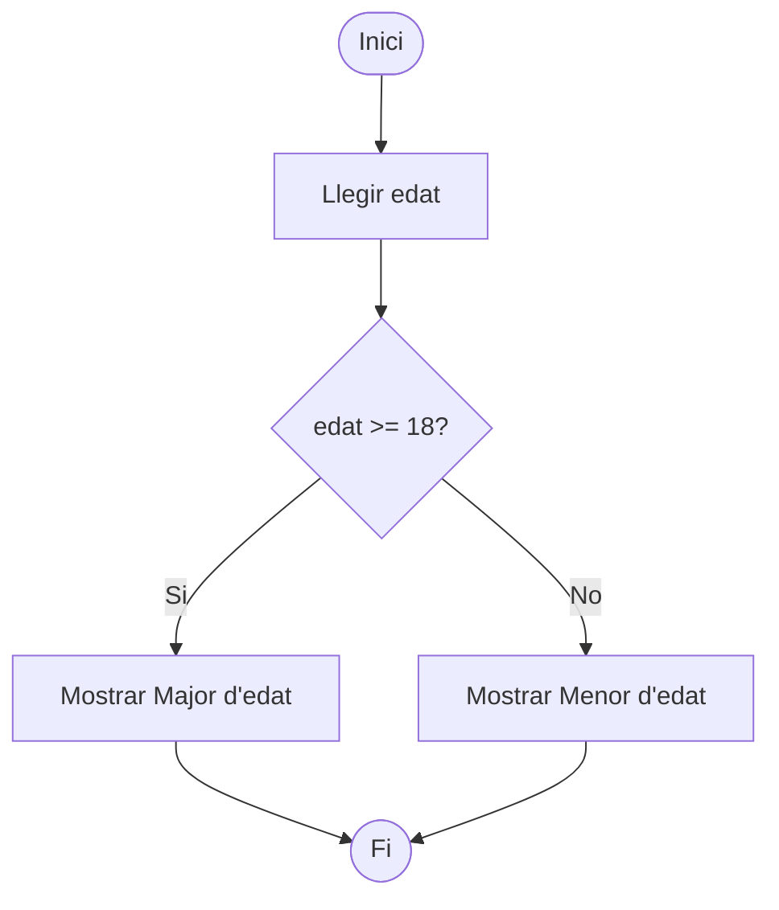
```mermaid
flowchart TD
  A([Inici]) --> B[Llegir edat]
  B --> C{edat >= 18?}
  C -->|Si| D[Mostrar Major d'edat]
  C -->|No| E[Mostrar Menor d'edat]
  D --> F([Fi])
  E --> F
```

### Exercici 16: Descompte

#### Enunciat

Aplicar un descompte del 10% si el preu supera 100.

#### Pseudocodi

```
INICI
   LLEGIR preu
   SI preu > 100 ALESHORES
      preu ← preu * 0.9
      FI
   ESCRIURE preu
FI
```

#### Diagrama de flux

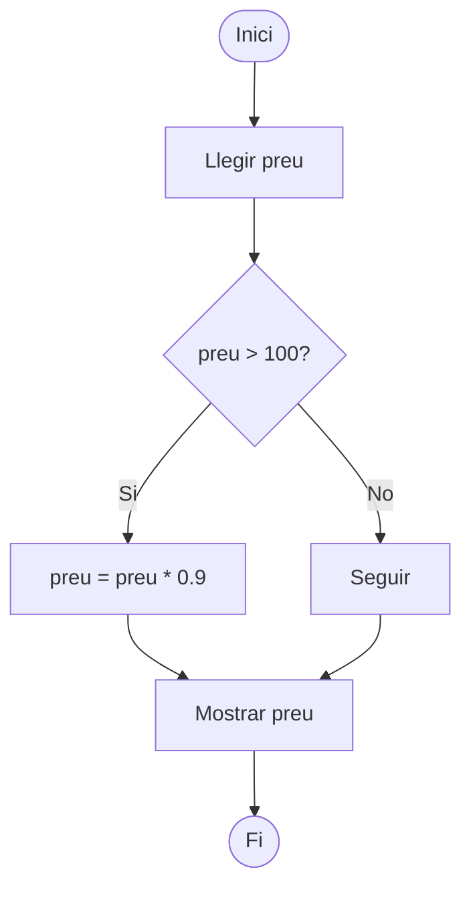
```mermaid
flowchart TD
  A([Inici]) --> B[Llegir preu]
  B --> C{preu > 100?}
  C -->|Si| D[preu = preu * 0.9]
  C -->|No| E[Seguir]
  D --> F[Mostrar preu]
  E --> F
  F --> G([Fi])
```

### Exercici 17: Classificar nota

#### Enunciat

Classificar una nota (0–10).

#### Pseudocodi

```
INICI
   LLEGIR nota
   SI nota < 5 ALESHORES
      ESCRIURE "Suspens"
   SINO
      SI nota < 7 ALESHORES
         ESCRIURE "Aprovat"
      SINO
         SI nota < 9 ALESHORES
            ESCRIURE "Notable"
         SINO
            ESCRIURE "Excel·lent"
FI
```

#### Diagrama de flux

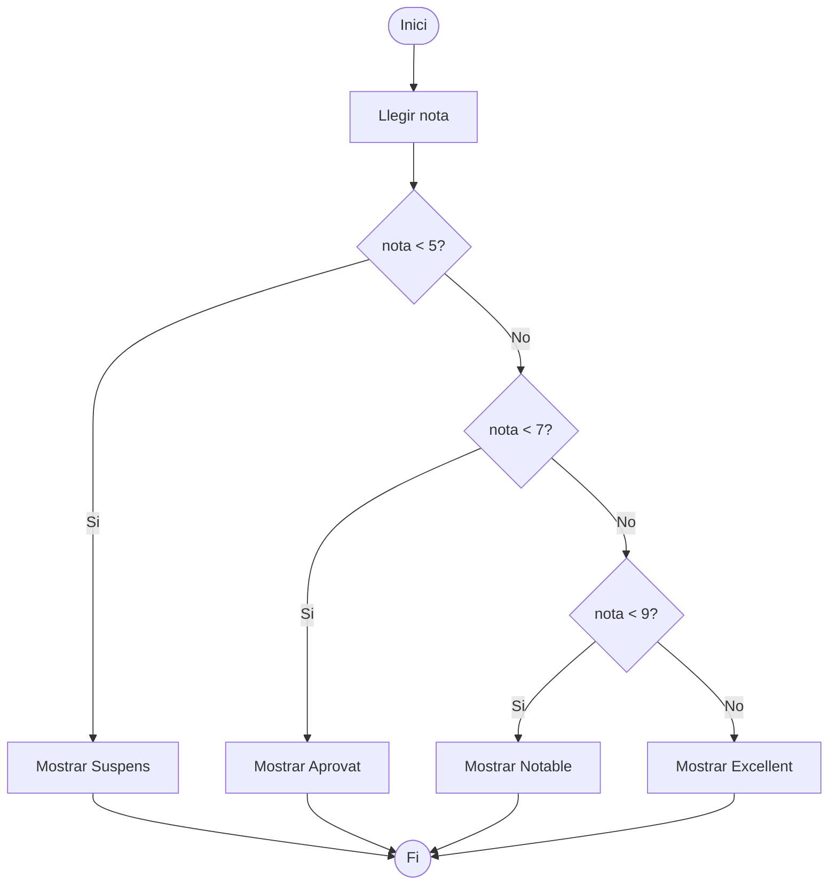
```mermaid
flowchart TD
  A([Inici]) --> B[Llegir nota]
  B --> C{nota < 5?}
  C -->|Si| D[Mostrar Suspens]
  C -->|No| E{nota < 7?}
  E -->|Si| F[Mostrar Aprovat]
  E -->|No| G{nota < 9?}
  G -->|Si| H[Mostrar Notable]
  G -->|No| I[Mostrar Excellent]
  D --> J([Fi])
  F --> J
  H --> J
  I --> J
```

### Exercici 18: Any de traspàs

#### Enunciat

Determinar si un any és de traspàs.

#### Pseudocodi

```
INICI
   LLEGIR any
   SI (any MOD 4 = 0 I any MOD 100 ≠ 0) O (any MOD 400 = 0) ALESHORES
      ESCRIURE "Traspàs"
   SINO
      ESCRIURE "No traspàs"
FI
```

#### Diagrama de flux

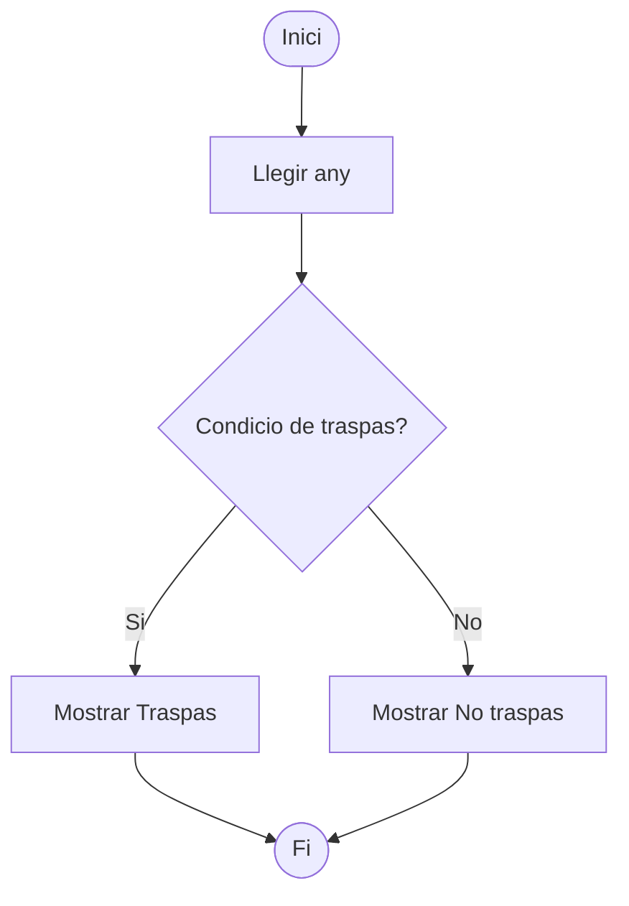
```mermaid
flowchart TD
  A([Inici]) --> B[Llegir any]
  B --> C{Condicio de traspas?}
  C -->|Si| D[Mostrar Traspas]
  C -->|No| E[Mostrar No traspas]
  D --> F([Fi])
  E --> F
```

### Exercici 19: Número dins interval

#### Enunciat

Comprovar si un número està entre dos valors.

#### Pseudocodi

```
INICI
   LLEGIR numero, min, max
   SI numero >= min I numero <= max ALESHORES
      ESCRIURE "Dins interval"
   SINO
   ESCRIURE "Fora interval"
FI
```

#### Diagrama de flux

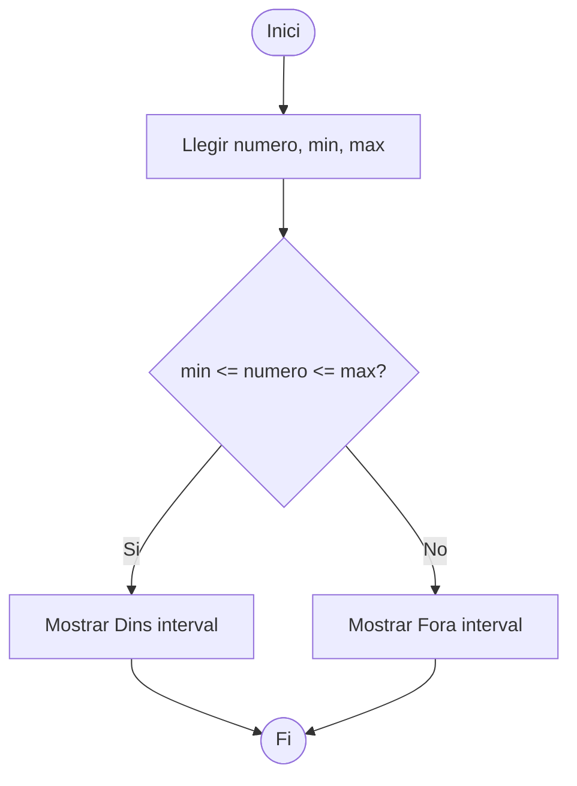
```mermaid
flowchart TD
  A([Inici]) --> B[Llegir numero, min, max]
  B --> C{min <= numero <= max?}
  C -->|Si| D[Mostrar Dins interval]
  C -->|No| E[Mostrar Fora interval]
  D --> F([Fi])
  E --> F
```

### Exercici 20: Menú simple

#### Enunciat

Mostrar un missatge segons l’opció triada (1, 2 o 3).

#### Pseudocodi

```
INICI
   LLEGIR opcio
   SI opcio = 1 ALESHORES
      ESCRIURE "Opció 1"
   SINO
      SI opcio = 2 ALESHORES
         ESCRIURE "Opció 2"
      SINO
         SI opcio = 3 ALESHORES
            ESCRIURE "Opció 3"
         SINO
            ESCRIURE "Opció incorrecta"
FI
```

#### Diagrama de flux

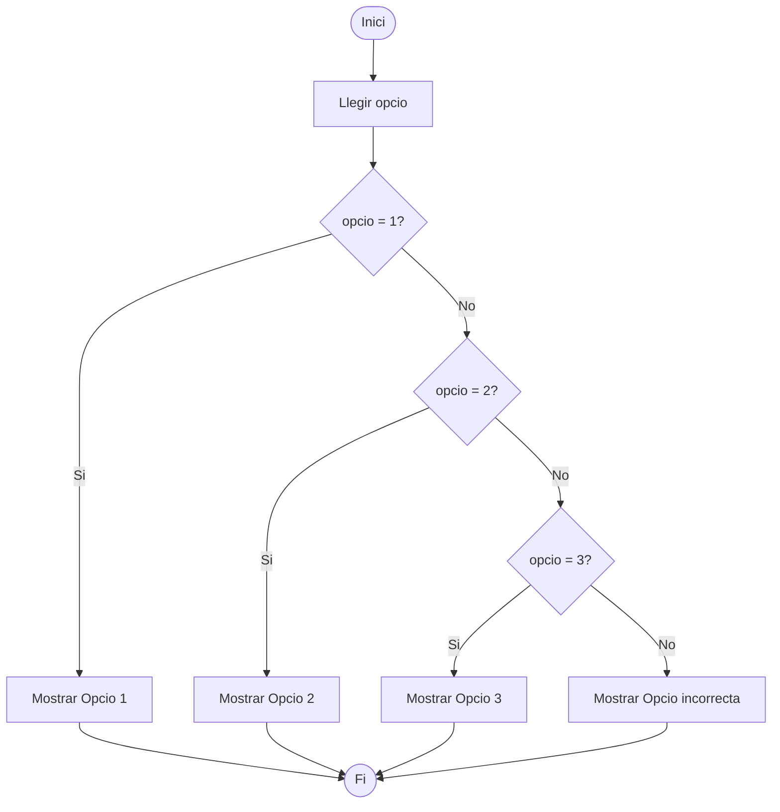
```mermaid
flowchart TD
  A([Inici]) --> B[Llegir opcio]
  B --> C{opcio = 1?}
  C -->|Si| D[Mostrar Opcio 1]
  C -->|No| E{opcio = 2?}
  E -->|Si| F[Mostrar Opcio 2]
  E -->|No| G{opcio = 3?}
  G -->|Si| H[Mostrar Opcio 3]
  G -->|No| I[Mostrar Opcio incorrecta]
  D --> J([Fi])
  F --> J
  H --> J
  I --> J
```

## Nivell 3 — Exercicis d’Algorísmica (Bucles)

### Exercici 21: Números de l’1 al 10

#### Enunciat

Mostrar els números de l’1 al 10.

#### Pseudocodi

```
INICI
   PER i ← 1 FINS 10 FER
      ESCRIURE i
   FI
FI
```

#### Diagrama de flux

```mermaid
flowchart TD
  A([Inici]) --> B[i = 1]
  B --> C{i <= 10?}
  C -->|Si| D[Mostrar i]
  D --> E[i = i + 1]
  E --> C
  C -->|No| F([Fi])
```

### Exercici 22: Números del 10 al 1

#### Enunciat

Mostrar els números del 10 al 1.

#### Pseudocodi

```
INICI
   PER i ← 10 FINS 1 PAS -1 FER
      ESCRIURE i
   FI
FI
```

#### Diagrama de flux

```mermaid
flowchart TD
  A([Inici]) --> B[i = 10]
  B --> C{i >= 1?}
  C -->|Si| D[Mostrar i]
  D --> E[i = i - 1]
  E --> C
  C -->|No| F([Fi])
```

### Exercici 23: Suma dels primers N números

#### Enunciat

Calcular la suma dels N primers números naturals.

#### Pseudocodi

```
INICI
   LLEGIR N
   suma ← 0
   PER i ← 1 FINS N FER
      suma ← suma + i
   FI
   ESCRIURE suma
FI
```

#### Diagrama de flux

```mermaid
flowchart TD
  A([Inici]) --> B[Llegir N]
  B --> C[suma = 0, i = 1]
  C --> D{i <= N?}
  D -->|Si| E[suma = suma + i]
  E --> F[i = i + 1]
  F --> D
  D -->|No| G[Mostrar suma]
  G --> H([Fi])
```

### Exercici 24: Factorial

#### Enunciat

Calcular el factorial d’un número.

#### Pseudocodi

```
INICI
   LLEGIR N
   factorial ← 1
   PER i ← 1 FINS N FER
      factorial ← factorial * i
   FI
   ESCRIURE factorial
FI
```

#### Diagrama de flux

```mermaid
flowchart TD
  A([Inici]) --> B[Llegir N]
  B --> C[factorial = 1, i = 1]
  C --> D{i <= N?}
  D -->|Si| E[factorial = factorial * i]
  E --> F[i = i + 1]
  F --> D
  D -->|No| G[Mostrar factorial]
  G --> H([Fi])
```

### Exercici 25: Taula de multiplicar

#### Enunciat

Mostrar la taula de multiplicar d’un número.

#### Pseudocodi

```
INICI
   LLEGIR num
   PER i ← 1 FINS 10 FER
      resultat ← num * i
      ESCRIURE resultat
   FI
FI
```

#### Diagrama de flux

```mermaid
flowchart TD
  A([Inici]) --> B[Llegir num]
  B --> C[i = 1]
  C --> D{i <= 10?}
  D -->|Si| E[resultat = num * i]
  E --> F[Mostrar resultat]
  F --> G[i = i + 1]
  G --> D
  D -->|No| H([Fi])
```

### Exercici 26: Comptar parells fins N

#### Enunciat

Comptar quants números parells hi ha fins a N.

#### Pseudocodi

```
INICI
   LLEGIR N
   comptador ← 0
   PER i ← 1 FINS N FER
      SI i MOD 2 = 0 ALESHORES
         comptador ← comptador + 1
      FI
   FI
   ESCRIURE comptador
FI
```

#### Diagrama de flux

```mermaid
flowchart TD
  A([Inici]) --> B[Llegir N]
  B --> C[comptador = 0, i = 1]
  C --> D{i <= N?}
  D -->|Si| E{i MOD 2 = 0?}
  E -->|Si| F[comptador = comptador + 1]
  E -->|No| G[Seguir]
  F --> H[i = i + 1]
  G --> H
  H --> D
  D -->|No| I[Mostrar comptador]
  I --> J([Fi])
```

### Exercici 27: Llegir fins 0

#### Enunciat

Llegir números fins que l’usuari introdueixi 0.

#### Pseudocodi

```
INICI
   LLEGIR numero
   MENTRE numero ≠ 0 FER
      ESCRIURE numero
      LLEGIR numero
   FI
FI
```

#### Diagrama de flux

```mermaid
flowchart TD
  A([Inici]) --> B[Llegir numero]
  B --> C{numero != 0?}
  C -->|Si| D[Mostrar numero]
  D --> E[Llegir numero]
  E --> C
  C -->|No| F([Fi])
```

### Exercici 28: Mitjana de N números

#### Enunciat

Calcular la mitjana de N números introduïts.

#### Pseudocodi

```
INICI
   LLEGIR N
   suma ← 0
   PER i ← 1 FINS N FER
      LLEGIR num
      suma ← suma + num
   FI
   mitjana ← suma / N
   ESCRIURE mitjana
FI
```

#### Diagrama de flux

```mermaid
flowchart TD
  A([Inici]) --> B[Llegir N]
  B --> C[suma = 0, i = 1]
  C --> D{i <= N?}
  D -->|Si| E[Llegir num]
  E --> F[suma = suma + num]
  F --> G[i = i + 1]
  G --> D
  D -->|No| H[mitjana = suma / N]
  H --> I[Mostrar mitjana]
  I --> J([Fi])
```

### Exercici 29: Número més gran

#### Enunciat

Trobar el número més gran d’un conjunt de N números.

#### Pseudocodi

```
INICI
   LLEGIR N
   LLEGIR num
   major ← num
   PER i ← 2 FINS N FER
      LLEGIR num
      SI num > major ALESHORES
         major ← num
      FI
   FI
   ESCRIURE major
FI
```

#### Diagrama de flux

```mermaid
flowchart TD
  A([Inici]) --> B[Llegir N]
  B --> C[Llegir primer num]
  C --> D[major = num, i = 2]
  D --> E{i <= N?}
  E -->|Si| F[Llegir num]
  F --> G{num > major?}
  G -->|Si| H[major = num]
  G -->|No| I[Seguir]
  H --> J[i = i + 1]
  I --> J
  J --> E
  E -->|No| K[Mostrar major]
  K --> L([Fi])
```

### Exercici 30: Sumar només positius

#### Enunciat

Sumar només els números positius introduïts fins que sigui 0.

#### Pseudocodi

```
INICI
   suma ← 0
   LLEGIR num
   MENTRE num ≠ 0 FER
      SI num > 0 ALESHORES
         suma ← suma + num
      FI
      LLEGIR num
   FI
   ESCRIURE suma
FI
```

#### Diagrama de flux

```mermaid
flowchart TD
  A([Inici]) --> B[suma = 0]
  B --> C[Llegir num]
  C --> D{num != 0?}
  D -->|Si| E{num > 0?}
  E -->|Si| F[suma = suma + num]
  E -->|No| G[Seguir]
  F --> H[Llegir num]
  G --> H
  H --> D
  D -->|No| I[Mostrar suma]
  I --> J([Fi])
```

## Nivell 4 — Exercicis d’Algorísmica

### Exercici 31: Mostrar números parells fins N

#### Enunciat

Mostrar tots els números parells entre 1 i N.

#### Pseudocodi

```
INICI
   LLEGIR N
   PER i ← 1 FINS N FER
      SI i MOD 2 = 0 ALESHORES
         ESCRIURE i
      FI
   FI
FI
```

#### Diagrama de flux

```mermaid
flowchart TD
  A([Inici]) --> B[Llegir N]
  B --> C[i = 1]
  C --> D{i <= N?}
  D -->|Si| E{i MOD 2 = 0?}
  E -->|Si| F[Mostrar i]
  E -->|No| G[Seguir]
  F --> H[i = i + 1]
  G --> H
  H --> D
  D -->|No| I([Fi])
```

### Exercici 32: Comptar números negatius

#### Enunciat

Llegir N números i comptar quants són negatius.

#### Pseudocodi

```
INICI
   LLEGIR N
   comptador ← 0
   PER i ← 1 FINS N FER
      LLEGIR num
      SI num < 0 ALESHORES
         comptador ← comptador + 1
      FI
   FI
   ESCRIURE comptador
FI
```

#### Diagrama de flux

```mermaid
flowchart TD
  A([Inici]) --> B[Llegir N]
  B --> C[comptador = 0, i = 1]
  C --> D{i <= N?}
  D -->|Si| E[Llegir num]
  E --> F{num < 0?}
  F -->|Si| G[comptador = comptador + 1]
  F -->|No| H[Seguir]
  G --> I[i = i + 1]
  H --> I
  I --> D
  D -->|No| J[Mostrar comptador]
  J --> K([Fi])
```

### Exercici 33: Suma múltiples de 3

#### Enunciat

Sumar tots els números múltiples de 3 entre 1 i N.

#### Pseudocodi

```
INICI
   LLEGIR N
   suma ← 0
   PER i ← 1 FINS N FER
      SI i MOD 3 = 0 ALESHORES
         suma ← suma + i
      FI
   FI
   ESCRIURE suma
FI
```

#### Diagrama de flux

```mermaid
flowchart TD
  A([Inici]) --> B[Llegir N]
  B --> C[suma = 0, i = 1]
  C --> D{i <= N?}
  D -->|Si| E{i MOD 3 = 0?}
  E -->|Si| F[suma = suma + i]
  E -->|No| G[Seguir]
  F --> H[i = i + 1]
  G --> H
  H --> D
  D -->|No| I[Mostrar suma]
  I --> J([Fi])
```

### Exercici 34: Validar contrasenya

#### Enunciat

Demostrar una contrasenya fins que sigui correcta.

#### Pseudocodi

```
INICI
   contrasenya_correcta ← "1234"
   LLEGIR contrasenya
   MENTRE contrasenya ≠ contrasenya_correcta FER
      ESCRIURE "Incorrecta"
      LLEGIR contrasenya
   FI
   ESCRIURE "Correcta"
FI
```

#### Diagrama de flux

```mermaid
flowchart TD
  A([Inici]) --> B[contrasenya_correcta = 1234]
  B --> C[Llegir contrasenya]
  C --> D{contrasenya correcta?}
  D -->|No| E[Mostrar Incorrecta]
  E --> C
  D -->|Si| F[Mostrar Correcta]
  F --> G([Fi])
```

### Exercici 35: Endevinar número

#### Enunciat

Fer un joc on l’usuari ha d’endevinar un número.

#### Pseudocodi

```
INICI
   secret ← 7
   LLEGIR intent
   MENTRE intent ≠ secret FER
      SI intent < secret ALESHORES
         ESCRIURE "Massa petit"
      SINO
         ESCRIURE "Massa gran"
      FI
      LLEGIR intent
   FI
   ESCRIURE "Correcte"
FI
```

#### Diagrama de flux

```mermaid
flowchart TD
  A([Inici]) --> B[secret = 7]
  B --> C[Llegir intent]
  C --> D{intent = secret?}
  D -->|Si| E[Mostrar Correcte]
  D -->|No| F{intent < secret?}
  F -->|Si| G[Mostrar Massa petit]
  F -->|No| H[Mostrar Massa gran]
  G --> C
  H --> C
  E --> I([Fi])
```

### Exercici 36: Sumar fins superar límit

#### Enunciat

Sumar números fins que la suma superi un valor determinat.

#### Pseudocodi

```
INICI
   suma ← 0
   MENTRE suma <= 100 FER
      LLEGIR num
      suma ← suma + num
   FI
   ESCRIURE suma
FI
```

#### Diagrama de flux

```mermaid
flowchart TD
  A([Inici]) --> B[suma = 0]
  B --> C{suma <= 100?}
  C -->|Si| D[Llegir num]
  D --> E[suma = suma + num]
  E --> C
  C -->|No| F[Mostrar suma]
  F --> G([Fi])
```

### Exercici 37: Divisors d’un número

#### Enunciat

Mostrar tots els divisors d’un número.

#### Pseudocodi

```
INICI
   LLEGIR N
   PER i ← 1 FINS N FER
      SI N MOD i = 0 ALESHORES
         ESCRIURE i
      FI
   FI
FI
```

#### Diagrama de flux

```mermaid
flowchart TD
  A([Inici]) --> B[Llegir N]
  B --> C[i = 1]
  C --> D{i <= N?}
  D -->|Si| E{N MOD i = 0?}
  E -->|Si| F[Mostrar i]
  E -->|No| G[Seguir]
  F --> H[i = i + 1]
  G --> H
  H --> D
  D -->|No| I([Fi])
```

### Exercici 38: Número primer

#### Enunciat

Comprovar si un número és primer.

#### Pseudocodi

```
INICI
   LLEGIR N
   comptador ← 0
   PER i ← 1 FINS N FER
      SI N MOD i = 0 ALESHORES
         comptador ← comptador + 1
      FI
   FI
   SI comptador = 2 ALESHORES
      ESCRIURE "Primer"
   SINO
      ESCRIURE "No primer"
FI
```

#### Diagrama de flux

```mermaid
flowchart TD
  A([Inici]) --> B[Llegir N]
  B --> C[comptador = 0, i = 1]
  C --> D{i <= N?}
  D -->|Si| E{N MOD i = 0?}
  E -->|Si| F[comptador = comptador + 1]
  E -->|No| G[Seguir]
  F --> H[i = i + 1]
  G --> H
  H --> D
  D -->|No| I{comptador = 2?}
  I -->|Si| J[Mostrar Primer]
  I -->|No| K[Mostrar No primer]
  J --> L([Fi])
  K --> L
```

### Exercici 39: Fibonacci

#### Enunciat

Generar la sèrie de Fibonacci fins N termes.

#### Pseudocodi

```
INICI
   LLEGIR N
   a ← 0
   b ← 1
   PER i ← 1 FINS N FER
      ESCRIURE a
      temp ← a + b
      a ← b
      b ← temp
   FI
FI
```

#### Diagrama de flux

```mermaid
flowchart TD
  A([Inici]) --> B[Llegir N]
  B --> C[a = 0, b = 1, i = 1]
  C --> D{i <= N?}
  D -->|Si| E[Mostrar a]
  E --> F[temp = a + b]
  F --> G[a = b]
  G --> H[b = temp]
  H --> I[i = i + 1]
  I --> D
  D -->|No| J([Fi])
```

### Exercici 40: Decimal a binari

#### Enunciat

Convertir un número decimal a binari.

#### Pseudocodi

```
INICI
   LLEGIR num
   resultat ← ""
   MENTRE num > 0 FER
      residu ← num MOD 2
      resultat ← residu + resultat
      num ← num DIV 2
   FI
   ESCRIURE resultat
FI
```

#### Diagrama de flux

```mermaid
flowchart TD
  A([Inici]) --> B[Llegir num]
  B --> C[resultat = buit]
  C --> D{num > 0?}
  D -->|Si| E[residu = num MOD 2]
  E --> F[resultat = residu + resultat]
  F --> G[num = num DIV 2]
  G --> D
  D -->|No| H[Mostrar resultat]
  H --> I([Fi])
```

## Nivell 5 — Exercicis d’Algorísmica (Arrays / Vectors)

### Exercici 41: Llegir un array de N números

#### Enunciat

Llegir N números i guardar-los en un vector.

#### Pseudocodi

```
INICI
   LLEGIR N
   DIM vector[N]
   PER i ← 0 FINS N-1 FER
      LLEGIR vector[i]
   FI
FI
```

#### Diagrama de flux

```mermaid
flowchart TD
  A([Inici]) --> B[Llegir N]
  B --> C[Crear vector]
  C --> D[i = 0]
  D --> E{i < N?}
  E -->|Si| F["Llegir vector[i]"]
  F --> G[i = i + 1]
  G --> E
  E -->|No| H([Fi])
```

### Exercici 42: Mostrar els elements d’un array

#### Enunciat

Mostrar tots els elements d’un vector.

#### Pseudocodi

```
INICI
   LLEGIR N
   DIM vector[N]
   PER i ← 0 FINS N-1 FER
      LLEGIR vector[i]
   FI
   PER i ← 0 FINS N-1 FER
      ESCRIURE vector[i]
   FI
FI
```

#### Diagrama de flux

```mermaid
flowchart TD
  A([Inici]) --> B[Array omplert]
  B --> C[i = 0]
  C --> D{i < N?}
  D -->|Si| E["Mostrar vector[i]"]
  E --> F[i = i + 1]
  F --> D
  D -->|No| G([Fi])
```

### Exercici 43: Sumar tots els elements

#### Enunciat

Calcular la suma de tots els elements d’un vector.

#### Pseudocodi

```
INICI
   LLEGIR N
   DIM vector[N]
   suma ← 0
   PER i ← 0 FINS N-1 FER
      LLEGIR vector[i]
      suma ← suma + vector[i]
   FI
   ESCRIURE suma
FI
```

#### Diagrama de flux

```mermaid
flowchart TD
  A([Inici]) --> B[Llegir N i vector]
  B --> C[suma = 0, i = 0]
  C --> D{i < N?}
  D -->|Si| E["suma = suma + vector[i]"]
  E --> F[i = i + 1]
  F --> D
  D -->|No| G[Mostrar suma]
  G --> H([Fi])
```

### Exercici 44: Trobar el valor màxim

#### Enunciat

Determinar quin és el valor més gran d’un vector.

#### Pseudocodi

```
INICI
   LLEGIR N
   DIM vector[N]
   PER i ← 0 FINS N-1 FER
      LLEGIR vector[i]
   FI
   maxim ← vector[0]
   PER i ← 1 FINS N-1 FER
      SI vector[i] > maxim ALESHORES
         maxim ← vector[i]
      FI
   FI
   ESCRIURE maxim
FI
```

#### Diagrama de flux

```mermaid
flowchart TD
  A([Inici]) --> B[Llegir N i vector]
  B --> C["maxim = vector[0], i = 1"]
  C --> D{i < N?}
  D -->|Si| E{"vector[i] > maxim?"}
  E -->|Si| F["maxim = vector[i]"]
  E -->|No| G[Seguir]
  F --> H[i = i + 1]
  G --> H
  H --> D
  D -->|No| I[Mostrar maxim]
  I --> J([Fi])
```

### Exercici 45: Trobar el valor mínim

#### Enunciat

Determinar quin és el valor més petit d’un vector.

#### Pseudocodi

```
INICI
   LLEGIR N
   DIM vector[N]
   PER i ← 0 FINS N-1 FER
      LLEGIR vector[i]
   FI
   minim ← vector[0]
   PER i ← 1 FINS N-1 FER
      SI vector[i] < minim ALESHORES
         minim ← vector[i]
      FI
   FI
   ESCRIURE minim
FI
```

#### Diagrama de flux

```mermaid
flowchart TD
  A([Inici]) --> B[Llegir N i vector]
  B --> C["minim = vector[0], i = 1"]
  C --> D{i < N?}
  D -->|Si| E{"vector[i] < minim?"}
  E -->|Si| F["minim = vector[i]"]
  E -->|No| G[Seguir]
  F --> H[i = i + 1]
  G --> H
  H --> D
  D -->|No| I[Mostrar minim]
  I --> J([Fi])
```

### Exercici 46: Calcular la mitjana

#### Enunciat

Calcular la mitjana dels valors d’un vector.

#### Pseudocodi

```
INICI
   LLEGIR N
   DIM vector[N]
   suma ← 0
   PER i ← 0 FINS N-1 FER
      LLEGIR vector[i]
      suma ← suma + vector[i]
   FI
   mitjana ← suma / N
   ESCRIURE mitjana
FI
```

#### Diagrama de flux

```mermaid
flowchart TD
  A([Inici]) --> B[Llegir N i vector]
  B --> C[suma = 0, i = 0]
  C --> D{i < N?}
  D -->|Si| E["suma = suma + vector[i]"]
  E --> F[i = i + 1]
  F --> D
  D -->|No| G[mitjana = suma / N]
  G --> H[Mostrar mitjana]
  H --> I([Fi])
```

### Exercici 47: Comptar elements parells

#### Enunciat

Comptar quants elements parells hi ha en un vector.

#### Pseudocodi

```
INICI
   LLEGIR N
   DIM vector[N]
   comptador ← 0
   PER i ← 0 FINS N-1 FER
      LLEGIR vector[i]
      SI vector[i] MOD 2 = 0 ALESHORES
         comptador ← comptador + 1
      FI
   FI
   ESCRIURE comptador
FI
```

#### Diagrama de flux

```mermaid
flowchart TD
  A([Inici]) --> B[Llegir N i vector]
  B --> C[comptador = 0, i = 0]
  C --> D{i < N?}
  D -->|Si| E{"vector[i] MOD 2 = 0?"}
  E -->|Si| F[comptador = comptador + 1]
  E -->|No| G[Seguir]
  F --> H[i = i + 1]
  G --> H
  H --> D
  D -->|No| I[Mostrar comptador]
  I --> J([Fi])
```

### Exercici 48: Buscar un element dins l’array

#### Enunciat

Comprovar si un valor es troba dins d’un vector.

#### Pseudocodi

```
INICI
   LLEGIR N
   DIM vector[N]
   PER i ← 0 FINS N-1 FER
      LLEGIR vector[i]
   FI
   LLEGIR valor
   trobat ← FALS
   i ← 0
   MENTRE i < N I trobat = FALS FER
      SI vector[i] = valor ALESHORES
         trobat ← CERT
      SINO
         i ← i + 1
      FI
   FI
   SI trobat = CERT ALESHORES
      ESCRIURE "Trobat"
   SINO
      ESCRIURE "No trobat"
   FI
FI
```

#### Diagrama de flux

```mermaid
flowchart TD
  A([Inici]) --> B[Llegir N, vector i valor]
  B --> C[trobat = fals, i = 0]
  C --> D{i < N i no trobat?}
  D -->|Si| E{"vector[i] = valor?"}
  E -->|Si| F[trobat = cert]
  E -->|No| G[i = i + 1]
  F --> H{trobat?}
  G --> D
  D -->|No| H{trobat?}
  H -->|Si| I[Mostrar Trobat]
  H -->|No| J[Mostrar No trobat]
  I --> K([Fi])
  J --> K
```

### Exercici 49: Invertir un array

#### Enunciat

Mostrar els elements d’un vector en ordre invers.

#### Pseudocodi

```
INICI
   LLEGIR N
   DIM vector[N]
   PER i ← 0 FINS N-1 FER
      LLEGIR vector[i]
   FI
   PER i ← N-1 FINS 0 PAS -1 FER
      ESCRIURE vector[i]
   FI
FI
```

#### Diagrama de flux

```mermaid
flowchart TD
  A([Inici]) --> B[Llegir N i vector]
  B --> C[i = N - 1]
  C --> D{i >= 0?}
  D -->|Si| E["Mostrar vector[i]"]
  E --> F[i = i - 1]
  F --> D
  D -->|No| G([Fi])
```

### Exercici 50: Ordenar un array (Bubble Sort)

#### Enunciat

Ordenar un vector de menor a major amb el mètode de la bombolla.

#### Pseudocodi

```
INICI
   LLEGIR N
   DIM vector[N]
   PER i ← 0 FINS N-1 FER
      LLEGIR vector[i]
   FI
   PER i ← 0 FINS N-2 FER
      PER j ← 0 FINS N-2-i FER
         SI vector[j] > vector[j+1] ALESHORES
            temp ← vector[j]
            vector[j] ← vector[j+1]
            vector[j+1] ← temp
         FI
      FI
   FI
   PER i ← 0 FINS N-1 FER
      ESCRIURE vector[i]
   FI
FI
```

#### Diagrama de flux

```mermaid
flowchart TD
  A([Inici]) --> B[Llegir N i vector]
  B --> C[i = 0]
  C --> D{i < N - 1?}
  D -->|Si| E[j = 0]
  E --> F{j < N - 1 - i?}
  F -->|Si| G{"vector[j] > vector[j+1]?"}
  G -->|Si| H[Intercanviar valors]
  G -->|No| I[Seguir]
  H --> J[j = j + 1]
  I --> J
  J --> F
  F -->|No| K[i = i + 1]
  K --> D
  D -->|No| L[Mostrar vector ordenat]
  L --> M([Fi])
```

## Nivell 6 — Exercicis d’Algorísmica (Arrays avançats)

### Exercici 51: Eliminar elements duplicats

#### Enunciat

Donat un vector, crear-ne un de nou sense elements duplicats.

#### Pseudocodi

```
INICI
   LLEGIR N
   DIM vector[N]
   DIM resultat[N]
   M ← 0
   PER i ← 0 FINS N-1 FER
      LLEGIR vector[i]
   FI
   PER i ← 0 FINS N-1 FER
      repetit ← FALS
      PER j ← 0 FINS M-1 FER
         SI vector[i] = resultat[j] ALESHORES
            repetit ← CERT
         FI
      FI
      SI repetit = FALS ALESHORES
         resultat[M] ← vector[i]
         M ← M + 1
      FI
   FI
   PER i ← 0 FINS M-1 FER
      ESCRIURE resultat[i]
   FI
FI
```

#### Diagrama de flux

```mermaid
flowchart TD
  A([Inici]) --> B[Llegir N i vector]
  B --> C[Crear resultat buit]
  C --> D[Recorrer vector]
  D --> E{Element ja es a resultat?}
  E -->|No| F[Afegir element a resultat]
  E -->|Si| G[Seguir]
  F --> H{Queden elements?}
  G --> H
  H -->|Si| D
  H -->|No| I[Mostrar resultat]
  I --> J([Fi])
```

### Exercici 52: Fusionar dos arrays

#### Enunciat

Unir dos vectors en un tercer vector.

#### Pseudocodi

```
INICI
   LLEGIR N
   LLEGIR M
   DIM A[N]
   DIM B[M]
   DIM C[N+M]
   PER i ← 0 FINS N-1 FER
      LLEGIR A[i]
   FI
   PER i ← 0 FINS M-1 FER
      LLEGIR B[i]
   FI
   PER i ← 0 FINS N-1 FER
      C[i] ← A[i]
   FI
   PER i ← 0 FINS M-1 FER
      C[N+i] ← B[i]
   FI
   PER i ← 0 FINS N+M-1 FER
      ESCRIURE C[i]
   FI
FI
```

#### Diagrama de flux

```mermaid
flowchart TD
  A([Inici]) --> B[Llegir N, M, A i B]
  B --> C[Copiar A a C]
  C --> D[Copiar B a continuacio de C]
  D --> E[Mostrar C]
  E --> F([Fi])
```

### Exercici 53: Trobar el segon valor més gran

#### Enunciat

Trobar el segon element més gran d’un vector.

#### Pseudocodi

```
INICI
   LLEGIR N
   DIM vector[N]
   PER i ← 0 FINS N-1 FER
      LLEGIR vector[i]
   FI
   major ← -999999
   segon ← -999999
   PER i ← 0 FINS N-1 FER
      SI vector[i] > major ALESHORES
         segon ← major
         major ← vector[i]
      SINO
         SI vector[i] > segon I vector[i] < major ALESHORES
            segon ← vector[i]
      FI
   FI
   ESCRIURE segon
FI
```

#### Diagrama de flux

```mermaid
flowchart TD
  A([Inici]) --> B[Llegir N i vector]
  B --> C[Inicialitzar major i segon]
  C --> D[Recorrer vector]
  D --> E{valor > major?}
  E -->|Si| F[segon = major; major = valor]
  E -->|No| G{valor > segon i valor < major?}
  G -->|Si| H[segon = valor]
  G -->|No| I[Seguir]
  F --> J{Queden elements?}
  H --> J
  I --> J
  J -->|Si| D
  J -->|No| K[Mostrar segon]
  K --> L([Fi])
```

### Exercici 54: Comptar freqüències d’elements

#### Enunciat

Mostrar quantes vegades apareix cada element d’un vector.

#### Pseudocodi

```
INICI
   LLEGIR N
   DIM vector[N]
   DIM comptat[N]
   PER i ← 0 FINS N-1 FER
      LLEGIR vector[i]
      comptat[i] ← 0
   FI
   PER i ← 0 FINS N-1 FER
      SI comptat[i] = 0 ALESHORES
         freq ← 1
         PER j ← i+1 FINS N-1 FER
            SI vector[i] = vector[j] ALESHORES
               freq ← freq + 1
               comptat[j] ← 1
            FI
         FI
         ESCRIURE vector[i], freq
      FI
   FI
FI
```

#### Diagrama de flux

```mermaid
flowchart TD
  A([Inici]) --> B[Llegir N i vector]
  B --> C[Recorrer cada element]
  C --> D{Ja comptat?}
  D -->|Si| E[Seguir]
  D -->|No| F[Comptar repeticions]
  F --> G[Mostrar valor i frequencia]
  E --> H{Queden elements?}
  G --> H
  H -->|Si| C
  H -->|No| I([Fi])
```

### Exercici 55: Rotar un array

#### Enunciat

Rotar un vector una posició cap a la dreta.

#### Pseudocodi

```
INICI
   LLEGIR N
   DIM vector[N]
   PER i ← 0 FINS N-1 FER
      LLEGIR vector[i]
   FI
   ultim ← vector[N-1]
   PER i ← N-1 FINS 1 PAS -1 FER
      vector[i] ← vector[i-1]
   FI
   vector[0] ← ultim
   PER i ← 0 FINS N-1 FER
      ESCRIURE vector[i]
   FI
FI
```

#### Diagrama de flux

```mermaid
flowchart TD
  A([Inici]) --> B[Llegir N i vector]
  B --> C[Guardar ultim element]
  C --> D[Desplacar elements a la dreta]
  D --> E[Posar ultim al principi]
  E --> F[Mostrar vector]
  F --> G([Fi])
```

### Exercici 56: Cerca binària

#### Enunciat

Buscar un valor en un vector ordenat utilitzant cerca binària.

#### Pseudocodi

```
INICI
   LLEGIR N
   DIM vector[N]
   PER i ← 0 FINS N-1 FER
      LLEGIR vector[i]
   FI
   LLEGIR valor
   esquerra ← 0
   dreta ← N - 1
   trobat ← FALS
   MENTRE esquerra <= dreta I trobat = FALS FER
      mig ← (esquerra + dreta) DIV 2
      SI vector[mig] = valor ALESHORES
         trobat ← CERT
      SINO
         SI valor < vector[mig] ALESHORES
            dreta ← mig - 1
         SINO
            esquerra ← mig + 1
         FI
      FI
   SI trobat = CERT ALESHORES
      ESCRIURE "Trobat"
   SINO
      ESCRIURE "No trobat"
   FI
FI
```

#### Diagrama de flux

```mermaid
flowchart TD
  A([Inici]) --> B[Llegir vector ordenat i valor]
  B --> C[esquerra = 0, dreta = N - 1]
  C --> D{esquerra <= dreta?}
  D -->|Si| E["mig = (esquerra + dreta) DIV 2"]
  E --> F{"vector[mig] = valor?"}
  F -->|Si| G[Mostrar Trobat]
  F -->|No| H{"valor < vector[mig]?"}
  H -->|Si| I[dreta = mig - 1]
  H -->|No| J[esquerra = mig + 1]
  I --> D
  J --> D
  D -->|No| K[Mostrar No trobat]
  G --> L([Fi])
  K --> L
```

### Exercici 57: Separar parells i senars

#### Enunciat

Separar els elements d’un vector en dos vectors: un de parells i un de senars.

#### Pseudocodi

```
INICI
   LLEGIR N
   DIM vector[N]
   DIM parells[N]
   DIM senars[N] 
   cp ← 0 
   cs ← 0  
   PER i ← 0 FINS N-1 FER   
      LLEGIR vector[i]     
      SI vector[i] MOD 2 = 0 ALESHORES     
         parells[cp] ← vector[i]        
         cp ← cp + 1      
      SINO
         senars[cs] ← vector[i]    
         cs ← cs + 1     
      FI 
   FI   
   ESCRIURE "Parells:"   
   PER i ← 0 FINS cp-1 FER    
      ESCRIURE parells[i] 
   FI
   ESCRIURE "Senars:" 
   PER i ← 0 FINS cs-1 FER 
      ESCRIURE senars[i] 
   FI
FI
```

#### Diagrama de flux

```mermaid
flowchart TD
  A([Inici]) --> B[Llegir N i vector]
  B --> C[Recorrer vector]
  C --> D{Element parell?}
  D -->|Si| E[Afegir a parells]
  D -->|No| F[Afegir a senars]
  E --> G{Queden elements?}
  F --> G
  G -->|Si| C
  G -->|No| H[Mostrar parells i senars]
  H --> I([Fi])
```

### Exercici 58: Comparar dos arrays

#### Enunciat

Comprovar si dos vectors són iguals element a element.

#### Pseudocodi

```
INICI
   LLEGIR N  
   DIM A[N] 
   DIM B[N] 
   PER i ← 0 FINS N-1 FER 
      LLEGIR A[i]  
   FI
   PER i ← 0 FINS N-1 FER   
      LLEGIR B[i]   
   FI
   iguals ← CERT 
   i ← 0   
   MENTRE i < N I iguals = CERT FER  
      SI A[i] ≠ B[i] ALESHORES     
         iguals ← FALS       
      FI    
      i ← i + 1  
   FI   
   SI iguals = CERT ALESHORES 
      ESCRIURE "Iguals"  
   SINO       
      ESCRIURE "Diferents"   
   FI
FI
```

#### Diagrama de flux

```mermaid
flowchart TD
  A([Inici]) --> B[Llegir N, A i B]
  B --> C[iguals = cert, i = 0]
  C --> D{i < N i iguals?}
  D -->|Si| E{"A[i] = B[i]?"}
  E -->|Si| F[i = i + 1]
  E -->|No| G[iguals = fals]
  F --> D
  G --> H{iguals?}
  D -->|No| H{iguals?}
  H -->|Si| I[Mostrar Iguals]
  H -->|No| J[Mostrar Diferents]
  I --> K([Fi])
  J --> K
```

### Exercici 59: Ordenació per selecció

#### Enunciat

Ordenar un vector de menor a major amb el mètode de selecció.

#### Pseudocodi

```
INICI
   LLEGIR N   
   DIM vector[N]
   PER i ← 0 FINS N-1 FER    
      LLEGIR vector[i] 
   FI
   PER i ← 0 FINS N-2 FER       
      posMin ← i  
      PER j ← i+1 FINS N-1 FER   
         SI vector[j] < vector[posMin] ALESHORES   
            posMin ← j      
         FI    
      FI      
      temp ← vector[i]     
      vector[i] ← vector[posMin]     
      vector[posMin] ← temp 
   FI
   PER i ← 0 FINS N-1 FER 
      ESCRIURE vector[i]  
   FI
FI
```

#### Diagrama de flux

```mermaid
flowchart TD
  A([Inici]) --> B[Llegir N i vector]
  B --> C[i = 0]
  C --> D{i < N - 1?}
  D -->|Si| E[posMin = i]
  E --> F[Buscar posicio del minim]
  F --> G["Intercanviar vector[i] i vector[posMin]"]
  G --> H[i = i + 1]
  H --> D
  D -->|No| I[Mostrar vector ordenat]
  I --> J([Fi])
```

### Exercici 60: Ordenació per inserció

#### Enunciat

Ordenar un vector de menor a major amb el mètode d’inserció.

#### Pseudocodi

```
INICI
   LLEGIR N   
   DIM vector[N]  
   PER i ← 0 FINS N-1 FER    
      LLEGIR vector[i]  
   FI
   PER i ← 1 FINS N-1 FER     
      clau ← vector[i]    
      j ← i - 1  
      MENTRE j >= 0 I vector[j] > clau FER       
         vector[j+1] ← vector[j]    
         j ← j - 1 
      FI
      vector[j+1] ← clau 
   FI
   PER i ← 0 FINS N-1 FER      
      ESCRIURE vector[i]   
   FI
FI
```

#### Diagrama de flux

```mermaid
flowchart TD
  A([Inici]) --> B[Llegir N i vector]
  B --> C[i = 1]
  C --> D{i < N?}
  D -->|Si| E["clau = vector[i], j = i - 1"]
  E --> F{"j >= 0 i vector[j] > clau?"}
  F -->|Si| G["Desplacar vector[j] a vector[j+1]"]
  G --> H[j = j - 1]
  H --> F
  F -->|No| I["Inserir clau a vector[j+1]"]
  I --> J[i = i + 1]
  J --> D
  D -->|No| K[Mostrar vector ordenat]
  K --> L([Fi])
```

## Nivell 7 — Exercicis d’Algorísmica (Matrius)

### Exercici 61: Llegir una matriu

#### Enunciat

Llegir els valors d’una matriu de N files i M columnes.

#### Pseudocodi

```
INICI
   LLEGIR N, M 
   DIM matriu[N][M] 
   PER i ← 0 FINS N-1 FER   
      PER j ← 0 FINS M-1 FER      
         LLEGIR matriu[i][j]   
      FI
   FI
FI
```

#### Diagrama de flux

```mermaid
flowchart TD
  A([Inici]) --> B[Llegir N i M]
  B --> C[i = 0]
  C --> D{i < N?}
  D -->|Si| E[j = 0]
  E --> F{j < M?}
  F -->|Si| G["Llegir matriu[i][j]"]
  G --> H[j = j + 1]
  H --> F
  F -->|No| I[i = i + 1]
  I --> D
  D -->|No| J([Fi])
```

### Exercici 62: Mostrar una matriu

#### Enunciat

Mostrar els valors d’una matriu.

#### Pseudocodi

```
INICI
   LLEGIR N, M  
   DIM matriu[N][M]    
   (Omplir matriu)   
   PER i ← 0 FINS N-1 FER    
      PER j ← 0 FINS M-1 FER    
         ESCRIURE matriu[i][j]   
      FI
   FI
FI
```

#### Diagrama de flux

```mermaid
flowchart TD
  A([Inici]) --> B[Matriu omplerta]
  B --> C[Recorrer files i columnes]
  C --> D["Mostrar matriu[i][j]"]
  D --> E{Queden elements?}
  E -->|Si| C
  E -->|No| F([Fi])
```

### Exercici 63: Sumar tots els elements

#### Enunciat

Calcular la suma de tots els valors d’una matriu.

#### Pseudocodi

```
INICI
   LLEGIR N, M   
   DIM matriu[N][M] 
   suma ← 0 
   PER i ← 0 FINS N-1 FER 
      PER j ← 0 FINS M-1 FER  
         LLEGIR matriu[i][j]  
         suma ← suma + matriu[i][j]   
      FI
   FI
   ESCRIURE suma
FI
```

#### Diagrama de flux

```mermaid
flowchart TD
  A([Inici]) --> B[Llegir matriu]
  B --> C[suma = 0]
  C --> D[Recorrer matriu]
  D --> E["suma = suma + matriu[i][j]"]
  E --> F{Queden elements?}
  F -->|Si| D
  F -->|No| G[Mostrar suma]
  G --> H([Fi])
```

### Exercici 64: Suma per files

#### Enunciat

Calcular la suma de cada fila.

#### Pseudocodi

```
INICI
   LLEGIR N, M
   DIM matriu[N][M] 
   (Omplir matriu)   
   PER i ← 0 FINS N-1 FER 
      suma ← 0       
      PER j ← 0 FINS M-1 FER   
         suma ← suma + matriu[i][j] 
      FI       
      ESCRIURE suma   
   FI
FI
```

#### Diagrama de flux

```mermaid
flowchart TD
  A([Inici]) --> B[Llegir matriu]
  B --> C[Per cada fila]
  C --> D[suma = 0]
  D --> E[Recorrer columnes de la fila]
  E --> F[suma = suma + element]
  F --> G{Queden columnes?}
  G -->|Si| E
  G -->|No| H[Mostrar suma fila]
  H --> I{Queden files?}
  I -->|Si| C
  I -->|No| J([Fi])
```

### Exercici 65: Suma per columnes

#### Enunciat

Calcular la suma de cada columna.

#### Pseudocodi

```
INICI
   LLEGIR N, M   
   DIM matriu[N][M]  
   (Omplir matriu) 
   PER j ← 0 FINS M-1 FER  
      suma ← 0      
      PER i ← 0 FINS N-1 FER  
         suma ← suma + matriu[i][j]     
      FI       
      ESCRIURE suma  
   FI
FI
```

#### Diagrama de flux

```mermaid
flowchart TD
  A([Inici]) --> B[Llegir matriu]
  B --> C[Per cada columna]
  C --> D[suma = 0]
  D --> E[Recorrer files de la columna]
  E --> F[suma = suma + element]
  F --> G{Queden files?}
  G -->|Si| E
  G -->|No| H[Mostrar suma columna]
  H --> I{Queden columnes?}
  I -->|Si| C
  I -->|No| J([Fi])
```

### Exercici 66: Valor màxim

#### Enunciat

Trobar el valor més gran de la matriu.

#### Pseudocodi

```
INICI
   LLEGIR N, M 
   DIM matriu[N][M]  
   (Omplir matriu)   
   maxim ← matriu[0][0]  
   PER i ← 0 FINS N-1 FER    
      PER j ← 0 FINS M-1 FER   
         SI matriu[i][j] > maxim ALESHORES    
            maxim ← matriu[i][j]       
         FI    
      FI   
   FI   
   ESCRIURE maxim
FI
```

#### Diagrama de flux

```mermaid
flowchart TD
  A([Inici]) --> B[Llegir matriu]
  B --> C[maxim = primer element]
  C --> D[Recorrer matriu]
  D --> E{element > maxim?}
  E -->|Si| F[maxim = element]
  E -->|No| G[Seguir]
  F --> H{Queden elements?}
  G --> H
  H -->|Si| D
  H -->|No| I[Mostrar maxim]
  I --> J([Fi])
```

### Exercici 67: Transposar matriu

#### Enunciat

Obtenir la matriu transposada.

#### Pseudocodi

```
INICI
   LLEGIR N, M  
   DIM A[N][M]   
   DIM B[M][N] 
   (Omplir A)   
   PER i ← 0 FINS N-1 FER 
      PER j ← 0 FINS M-1 FER 
         B[j][i] ← A[i][j] 
      FI  
   FI  
   (Mostrar B)
FI
```

#### Diagrama de flux

```mermaid
flowchart TD
  A([Inici]) --> B[Llegir A]
  B --> C[Recorrer files i columnes]
  C --> D["B[j][i] = A[i][j]"]
  D --> E{Queden parelles i,j?}
  E -->|Si| C
  E -->|No| F[Mostrar B]
  F --> G([Fi])
```

### Exercici 68: Multiplicar matrius

#### Enunciat

Multiplicar dues matrius compatibles.

#### Pseudocodi

```
INICI
   LLEGIR N, M, P  
   DIM A[N][M]  
   DIM B[M][P] 
   DIM C[N][P] 
   (Omplir A i B)  
   PER i ← 0 FINS N-1 FER  
      PER j ← 0 FINS P-1 FER   
         C[i][j] ← 0       
         PER k ← 0 FINS M-1 FER    
            C[i][j] ← C[i][j] + A[i][k] * B[k][j]  
         FI    
      FI   
   FI  
   (Mostrar C)
FI
```

#### Diagrama de flux

```mermaid
flowchart TD
  A([Inici]) --> B[Llegir A i B]
  B --> C["Per cada posicio C[i][j]"]
  C --> D["Inicialitzar C[i][j] = 0"]
  D --> E[Recorrer k]
  E --> F["C[i][j] = C[i][j] + A[i][k] * B[k][j]"]
  F --> G{Queden valors k?}
  G -->|Si| E
  G -->|No| H{Queden posicions de C?}
  H -->|Si| C
  H -->|No| I[Mostrar C]
  I --> J([Fi])
```

### Exercici 69: Matriu identitat

#### Enunciat

Comprovar si una matriu és identitat.

#### Pseudocodi

```
INICI
   LLEGIR N  
   DIM matriu[N][N]  
   (Omplir matriu) 
   identitat ← CERT 
   PER i ← 0 FINS N-1 FER
      PER j ← 0 FINS N-1 FER 
         SI (i = j I matriu[i][j] ≠ 1) O (i ≠ j I matriu[i][j] ≠ 0) ALESHORES                
            identitat ← FALS 
         FI       
      FI  
   FI   
   SI identitat = CERT ALESHORES  
      ESCRIURE "Identitat"  
   SINO      
      ESCRIURE "No identitat"   
   FI
FI
```

#### Diagrama de flux

```mermaid
flowchart TD
  A([Inici]) --> B[Llegir matriu quadrada]
  B --> C[identitat = cert]
  C --> D[Recorrer i i j]
  D --> E{Condicio diagonal correcta?}
  E -->|No| F[identitat = fals]
  E -->|Si| G[Seguir]
  F --> H{Queden elements?}
  G --> H
  H -->|Si| D
  H -->|No| I{identitat?}
  I -->|Si| J[Mostrar Identitat]
  I -->|No| K[Mostrar No identitat]
  J --> L([Fi])
  K --> L
```

### Exercici 70: Diagonals

#### Enunciat

Mostrar la diagonal principal i secundària.

#### Pseudocodi

```
INICI
   LLEGIR N 
   DIM matriu[N][N] 
   (Omplir matriu)  
   ESCRIURE "Diagonal principal:"   
   PER i ← 0 FINS N-1 FER      
      ESCRIURE matriu[i][i]  
   FI   
   ESCRIURE "Diagonal secundària:"  
   PER i ← 0 FINS N-1 FER  
      ESCRIURE matriu[i][N-1-i]  
   FI
FI
```

#### Diagrama de flux

```mermaid
flowchart TD
  A([Inici]) --> B[Llegir matriu quadrada]
  B --> C[Recorrer i de 0 a N-1]
  C --> D["Mostrar matriu[i][i]"]
  D --> E["Mostrar matriu[i][N-1-i]"]
  E --> F{Queden valors d'i?}
  F -->|Si| C
  F -->|No| G([Fi])
```

## Nivell 8 — Exercicis d’Algorísmica (Problemes avançats)

### Exercici 71: Número palíndrom

#### Enunciat

Comprovar si un número es llegeix igual d’esquerra a dreta que de dreta a esquerra.

#### Pseudocodi

```
INICI
   LLEGIR num   
   original ← num 
   invertit ← 0   
   MENTRE num > 0 FER    
      digit ← num MOD 10  
      invertit ← invertit * 10 + digit  
      num ← num DIV 10  
   FI 
   SI original = invertit ALESHORES    
      ESCRIURE "Palíndrom" 
   SINO     
      ESCRIURE "No palíndrom" 
   FI
FI
```

#### Diagrama de flux

```mermaid
flowchart TD
  A([Inici]) --> B[Llegir num]
  B --> C[original = num, invertit = 0]
  C --> D{num > 0?}
  D -->|Si| E[digit = num MOD 10]
  E --> F[invertit = invertit*10 + digit]
  F --> G[num = num DIV 10]
  G --> D
  D -->|No| H{original = invertit?}
  H -->|Si| I[Mostrar Palindrom]
  H -->|No| J[Mostrar No palindrom]
  I --> K([Fi])
  J --> K
```

### Exercici 72: Paraula palíndroma

#### Enunciat

Comprovar si una paraula es llegeix igual al dret i al revés.

#### Pseudocodi

```
INICI
   LLEGIR paraula invertida ← ""  
   PER i ← LONGITUD(paraula)-1 FINS 0 PAS -1 FER   
      invertida ← invertida + paraula[i]  
   FI   
   SI paraula = invertida ALESHORES    
      ESCRIURE "Palíndroma"   
   SINO      
      ESCRIURE "No palíndroma"   
   FI
   FI
```

#### Diagrama de flux

```mermaid
flowchart TD
  A([Inici]) --> B[Llegir paraula]
  B --> C[invertida = buit]
  C --> D[Recorrer del final al principi]
  D --> E[Afegir caracter a invertida]
  E --> F{Queden lletres?}
  F -->|Si| D
  F -->|No| G{paraula = invertida?}
  G -->|Si| H[Mostrar Palindroma]
  G -->|No| I[Mostrar No palindroma]
  H --> J([Fi])
  I --> J
```

### Exercici 73: Caixer automàtic

#### Enunciat

Simular un caixer automàtic amb un saldo inicial. Permetre consultar saldo, ingressar diners i retirar diners mentre l’usuari no triï sortir.

#### Pseudocodi

```
INICI
   saldo ← 1000   
   opcio ← 0 
   MENTRE opcio ≠ 4 FER     
      ESCRIURE "1. Consultar saldo"  
      ESCRIURE "2. Ingressar"     
      ESCRIURE "3. Retirar"  
      ESCRIURE "4. Sortir"  
      LLEGIR opcio       
      SI opcio = 1 ALESHORES        
         ESCRIURE saldo       
      SINO 
         SI opcio = 2 ALESHORES      
            LLEGIR quantitat        
            SI quantitat > 0 ALESHORES        
               saldo ← saldo + quantitat     
            FI    
         SINO
            SI opcio = 3 ALESHORES        
               LLEGIR quantitat     
               SI quantitat > 0 I quantitat <= saldo ALESHORES  
                  saldo ← saldo - quantitat  
               SINO           
                  ESCRIURE "Saldo insuficient"   
               FI     
            SINO
               SI opcio = 4 ALESHORES   
                  ESCRIURE "Adéu"  
                  SINO  
                     ESCRIURE "Opció incorrecta"
      FI
   FI
FI
```

#### Diagrama de flux

```mermaid
flowchart TD
  A([Inici]) --> B[saldo = 1000]
  B --> C[Mostrar menu i llegir opcio]
  C --> D{opcio = 4?}
  D -->|Si| E[Mostrar Adeu]
  E --> F([Fi])
  D -->|No| G{opcio = 1, 2 o 3?}
  G -->|Consulta| H[Mostrar saldo]
  G -->|Ingressar| I[Llegir quantitat i sumar al saldo]
  G -->|Retirar| J{quantitat valida i saldo suficient?}
  J -->|Si| K[Restar quantitat]
  J -->|No| L[Mostrar Saldo insuficient]
  H --> C
  I --> C
  K --> C
  L --> C
```

### Exercici 74: Gestió d’una llista de notes

#### Enunciat

Llegir les notes d’una classe i mostrar la mitjana, la nota màxima i quants alumnes han aprovat.

#### Pseudocodi

```
INICI
   LLEGIR N  
   suma ← 0  
   maxim ← -1  
   aprovats ← 0
   PER i ← 1 FINS N FER     
      LLEGIR nota     
      suma ← suma + nota  
      SI nota > maxim ALESHORES
         maxim ← nota    
      FI  
      SI nota >= 5 ALESHORES
         aprovats ← aprovats + 1      
      FI 
   FI   
   mitjana ← suma / N  
   ESCRIURE mitjana   
   ESCRIURE maxim  
   ESCRIURE aprovats
FI
```

#### Diagrama de flux

```mermaid
flowchart TD
  A([Inici]) --> B[Llegir N]
  B --> C[Inicialitzar suma, maxim, aprovats]
  C --> D[Per cada nota]
  D --> E[Llegir nota]
  E --> F[suma = suma + nota]
  F --> G{nota > maxim?}
  G -->|Si| H[maxim = nota]
  G -->|No| I[Seguir]
  H --> J{nota >= 5?}
  I --> J
  J -->|Si| K[aprovats = aprovats + 1]
  J -->|No| L[Seguir]
  K --> M{Queden notes?}
  L --> M
  M -->|Si| D
  M -->|No| N[Calcular i mostrar resultats]
  N --> O([Fi])
```

### Exercici 75: Sistema de votacions

#### Enunciat

Llegir els vots de diversos participants (1, 2 o 3) i indicar quin candidat ha rebut més vots.

#### Pseudocodi

```
INICI
   LLEGIR N  
   v1 ← 0 
   v2 ← 0 
   v3 ← 0  
   PER i ← 1 FINS N FER    
      LLEGIR vot 
      SI vot = 1 ALESHORES    
         v1 ← v1 + 1    
      SINO 
         SI vot = 2 ALESHORES   
            v2 ← v2 + 1     
            SINO
               SI vot = 3 ALESHORES
                  v3 ← v3 + 1      
               FI  
            FI  
            SI v1 > v2 I v1 > v3 ALESHORES   
               ESCRIURE "Guanya candidat 1" 
               SINO
                  SI v2 > v1 I v2 > v3 ALESHORES 
                     ESCRIURE "Guanya candidat 2"  
                     SINO
                        SI v3 > v1 I v3 > v2 ALESHORES  
                           ESCRIURE "Guanya candidat 3"  
                           SINO  
                              ESCRIURE "Empat"
   FI
FI
```

#### Diagrama de flux

```mermaid
flowchart TD
  A([Inici]) --> B[Llegir N]
  B --> C[Inicialitzar v1, v2, v3]
  C --> D[Per cada vot]
  D --> E[Llegir vot]
  E --> F{vot = 1, 2 o 3?}
  F -->|1| G[v1 = v1 + 1]
  F -->|2| H[v2 = v2 + 1]
  F -->|3| I[v3 = v3 + 1]
  G --> J{Queden vots?}
  H --> J
  I --> J
  J -->|Si| D
  J -->|No| K[Comparar totals]
  K --> L[Mostrar guanyador o empat]
  L --> M([Fi])
```

### Exercici 76: Ordenar per múltiples criteris

#### Enunciat

Ordenar una llista de noms i notes: primer per nota descendent, i si dues notes són iguals, per nom alfabèticament.

#### Pseudocodi

```
INICI
   LLEGIR N   
   DIM noms[N]  
   DIM notes[N]   
   PER i ← 0 FINS N-1 FER   
      LLEGIR noms[i]      
      LLEGIR notes[i]  
   FI  
   PER i ← 0 FINS N-2 FER   
      PER j ← 0 FINS N-2-i FER     
         SI notes[j] < notes[j+1] ALESHORES  
            INTERCANVIAR notes[j] amb notes[j+1]  
            INTERCANVIAR noms[j] amb noms[j+1]    
         SINO
            SI notes[j] = notes[j+1] I noms[j] > noms[j+1] ALESHORES                      
               INTERCANVIAR noms[j] amb noms[j+1]               
               INTERCANVIAR notes[j] amb notes[j+1]    
         FI 
      FI  
   FI   
   PER i ← 0 FINS N-1 FER   
      ESCRIURE noms[i], notes[i]
   FI
FI
```

#### Diagrama de flux

```mermaid
flowchart TD
  A([Inici]) --> B[Llegir noms i notes]
  B --> C[Recorrer amb bubble sort]
  C --> D{"notes[j] < notes[j+1]?"}
  D -->|Si| E[Intercanviar nom i nota]
  D -->|No| F{"notes iguals i nom[j] > nom[j+1]?"}
  F -->|Si| G[Intercanviar posicions]
  F -->|No| H[Seguir]
  E --> I{Queden comparacions?}
  G --> I
  H --> I
  I -->|Si| C
  I -->|No| J[Mostrar llista ordenada]
  J --> K([Fi])
```

### Exercici 77: Simular una cua (queue)

#### Enunciat

Simular una cua amb les operacions afegir, treure i mostrar primer element.

#### Pseudocodi

```
INICI
   DIM cua[100] 
   inici ← 0  
   fi ← -1    
   opcio ← 0 
   MENTRE opcio ≠ 4 FER 
      ESCRIURE "1. Afegir"  
      ESCRIURE "2. Treure"    
      ESCRIURE "3. Mostrar primer"  
      ESCRIURE "4. Sortir" 
      LLEGIR opcio     
      SI opcio = 1 ALESHORES  
         LLEGIR valor  
         fi ← fi + 1    
         cua(([fi])) ← valor   
         SINO
            SI opcio = 2 ALESHORES 
               SI inici <= fi ALESHORES     
                  inici ← inici + 1      
               SINO           
                  ESCRIURE "Cua buida"   
               FI       
            SINO 
               SI opcio = 3 ALESHORES   
                  SI inici <= fi ALESHORES     
                     ESCRIURE cua(([inici]))          
                  SINO             
                     ESCRIURE "Cua buida"     
         FI    
      FI   
   FI
FI
```

#### Diagrama de flux

```mermaid
flowchart TD
  A([Inici]) --> B[Inicialitzar cua]
  B --> C[Mostrar menu i llegir opcio]
  C --> D{opcio = 4?}
  D -->|Si| E([Fi])
  D -->|No| F{opcio 1, 2 o 3?}
  F -->|Afegir| G[Inserir al final]
  F -->|Treure| H{Cua buida?}
  H -->|No| I[Augmentar inici]
  H -->|Si| J[Mostrar Cua buida]
  F -->|Mostrar primer| K{Cua buida?}
  K -->|No| L[Mostrar primer element]
  K -->|Si| M[Mostrar Cua buida]
  G --> C
  I --> C
  J --> C
  L --> C
  M --> C
```

### Exercici 78: Simular una pila (stack)

#### Enunciat

Simular una pila amb les operacions apilar, desapilar i veure el cim.

#### Pseudocodi

```
INICI
   DIM pila[100]   
   cim ← -1  
   opcio ← 0    
   MENTRE opcio ≠ 4 FER 
      ESCRIURE "1. Apilar"  
      ESCRIURE "2. Desapilar"    
      ESCRIURE "3. Veure cim"  
      ESCRIURE "4. Sortir"    
      LLEGIR opcio      
      SI opcio = 1 ALESHORES   
         LLEGIR valor         
         cim ← cim + 1        
         pila[cim] ← valor  
         SINO 
            SI opcio = 2 ALESHORES     
               SI cim >= 0 ALESHORES      
                  cim ← cim - 1    
               SINO     
                  ESCRIURE "Pila buida" 
               FI     
            SINO
               SI opcio = 3 ALESHORES   
                  SI cim >= 0 ALESHORES  
                     ESCRIURE pila[cim]        
                  SINO               
                     ESCRIURE "Pila buida"       
         FI   
      FI    
   FI
FI
```

#### Diagrama de flux

```mermaid
flowchart TD
  A([Inici]) --> B[Inicialitzar pila]
  B --> C[Mostrar menu i llegir opcio]
  C --> D{opcio = 4?}
  D -->|Si| E([Fi])
  D -->|No| F{opcio 1, 2 o 3?}
  F -->|Apilar| G[Posar element al cim]
  F -->|Desapilar| H{Pila buida?}
  H -->|No| I[Baixar cim]
  H -->|Si| J[Mostrar Pila buida]
  F -->|Veure cim| K{Pila buida?}
  K -->|No| L[Mostrar element del cim]
  K -->|Si| M[Mostrar Pila buida]
  G --> C
  I --> C
  J --> C
  L --> C
  M --> C
```

### Exercici 79: Comptar paraules d’una frase

#### Enunciat

Comptar quantes paraules hi ha en una frase.

#### Pseudocodi

```
INICI
   LLEGIR frase  
   comptador ← 0   
   dinsParaula ← FALS 
   PER i ← 0 FINS LONGITUD(frase)-1 FER  
      SI frase[i] ≠ ' ' I dinsParaula = FALS ALESHORES   
         comptador ← comptador + 1         
         dinsParaula ← CERT        
         SINO 
            SI frase[i] = ' ' ALESHORES     
               dinsParaula ← FALS    
      FI 
   FI 
   ESCRIURE comptador
FI
```

#### Diagrama de flux

```mermaid
flowchart TD
  A([Inici]) --> B[Llegir frase]
  B --> C[comptador = 0, dinsParaula = fals]
  C --> D[Recorrer caracters]
  D --> E{Caracter diferent d'espai i no dins paraula?}
  E -->|Si| F[comptador = comptador + 1; dinsParaula = cert]
  E -->|No| G{Caracter es espai?}
  G -->|Si| H[dinsParaula = fals]
  G -->|No| I[Seguir]
  F --> J{Queden caracters?}
  H --> J
  I --> J
  J -->|Si| D
  J -->|No| K[Mostrar comptador]
  K --> L([Fi])
```

### Exercici 80: Algorisme d’Euclides (MCD)

#### Enunciat

Calcular el màxim comú divisor (MCD) de dos números amb l’algorisme d’Euclides.

#### Pseudocodi

```
INICI
   LLEGIR a   
   LLEGIR b  
   MENTRE b ≠ 0 FER  
      residu ← a MOD b   
      a ← b    
      b ← residu    
   FI   
   ESCRIURE a
FI
```

#### Diagrama de flux

```mermaid
flowchart TD
  A([Inici]) --> B[Llegir a i b]
  B --> C{b != 0?}
  C -->|Si| D[residu = a MOD b]
  D --> E[a = b]
  E --> F[b = residu]
  F --> C
  C -->|No| G[Mostrar a]
  G --> H([Fi])
```

## Nivell 9 — Exercicis d’Algorísmica (Recursivitat)

### Exercici 81: Factorial recursiu

#### Enunciat

Calcular el factorial d’un número utilitzant recursivitat.

#### Pseudocodi

```
FUNCIO factorial(n)
   SI n = 0 ALESHORES     
      RETORN 1  
   SINO       
      RETORN n * factorial(n-1)   
   FI
FI_FUNCIO

INICI  
   LLEGIR num    
   resultat ← factorial(num)  
   ESCRIURE resultat
FI
```

#### Diagrama de flux

```mermaid
flowchart TD
  A["Crida factorial(n)"] --> B{n = 0?}
  B -->|Si| C[Retornar 1]
  B -->|No| D["Retornar n * factorial(n-1)"]
```

### Exercici 82: Fibonacci recursiu

#### Enunciat

Calcular el terme N de la seqüència de Fibonacci.

#### Pseudocodi

```
FUNCIO fibonacci(n)    
   SI n = 0 ALESHORES  
      RETORN 0
   SINO 
      SI n = 1 ALESHORES  
         RETORN 1    
      SINO      
         RETORN fibonacci(n-1) + fibonacci(n-2)  
   FI
FI_FUNCIO

INICI
   LLEGIR n   
   resultat ← fibonacci(n)   
   ESCRIURE resultat
FI
```

#### Diagrama de flux

```mermaid
flowchart TD
  A["Crida fibonacci(n)"] --> B{n = 0 o n = 1?}
  B -->|Si| C[Retornar n]
  B -->|No| D["Retornar fibonacci(n-1) + fibonacci(n-2)"]
```

### Exercici 83: Suma de dígits

#### Enunciat

Calcular la suma dels dígits d’un número.

#### Pseudocodi

```
FUNCIO sumaDigits(n) 
   SI n = 0 ALESHORES       
      RETORN 0 
   SINO      
      RETORN (n MOD 10) + sumaDigits(n DIV 10)   
   FI
FI_FUNCIO

INICI    
   LLEGIR num   
   resultat ← sumaDigits(num)  
   ESCRIURE resultat
FI
```

#### Diagrama de flux

```mermaid
flowchart TD
  A["Crida sumaDigits(n)"] --> B{n = 0?}
  B -->|Si| C[Retornar 0]
  B -->|No| D["Retornar n MOD 10 + sumaDigits(n DIV 10)"]
```

### Exercici 84: Potència recursiva

#### Enunciat

Calcular una potència (base^exponent) de forma recursiva.

#### Pseudocodi

```
FUNCIO potencia(base, exp)
   SI exp = 0 ALESHORES 
      RETORN 1   
   SINO        
      RETORN base * potencia(base, exp-1)    
   FI
FI_FUNCIO

INICI
   LLEGIR base, exponent 
   resultat ← potencia(base, exponent) 
   ESCRIURE resultat
FI
```

#### Diagrama de flux

```mermaid
flowchart TD
  A["Crida potencia(base, exp)"] --> B{exp = 0?}
  B -->|Si| C[Retornar 1]
  B -->|No| D["Retornar base * potencia(base, exp-1)"]
```

### Exercici 85: Recórrer array recursivament

#### Enunciat

Mostrar tots els elements d’un vector utilitzant recursivitat.

#### Pseudocodi

```
FUNCIO mostrar(vector, i, N)   
   SI i = N ALESHORES      
      RETORN    
   SINO       
      ESCRIURE vector[i]    
      mostrar(vector, i+1, N)  
   FI
FI_FUNCIO

INICI 
   LLEGIR N
   DIM vector[N]  
   PER i ← 0 FINS N-1 FER     
      LLEGIR vector[i] 
   FI   
   mostrar(vector, 0, N)
FI
```

#### Diagrama de flux

```mermaid
flowchart TD
  A["Crida mostrar(vector, i, N)"] --> B{i = N?}
  B -->|Si| C[Retorn]
  B -->|No| D["Mostrar vector[i]"]
  D --> E["Cridar mostrar(vector, i+1, N)"]
```

### Exercici 86: Torres de Hanoi

#### Enunciat

Resoldre el problema de les Torres de Hanoi.

#### Pseudocodi

```
FUNCIO hanoi(n, origen, desti, auxiliar) 
   SI n = 1 ALESHORES      
      ESCRIURE "Moure disc de", origen, "a", desti  
   SINO    
      hanoi(n-1, origen, auxiliar, desti)       
      ESCRIURE "Moure disc de", origen, "a", desti  
      hanoi(n-1, auxiliar, desti, origen)   
   FI
FI_FUNCIO

INICI   
   LLEGIR n 
   hanoi(n, "A", "C", "B")
FI
```

#### Diagrama de flux

```mermaid
flowchart TD
  A["Crida hanoi(n, origen, desti, auxiliar)"] --> B{n = 1?}
  B -->|Si| C[Moure disc d'origen a desti]
  B -->|No| D["hanoi(n-1, origen, auxiliar, desti)"]
  D --> E[Moure disc d'origen a desti]
  E --> F["hanoi(n-1, auxiliar, desti, origen)"]
```

### Exercici 87: Cerca binària recursiva

#### Enunciat

Buscar un element en un vector ordenat amb recursivitat.

#### Pseudocodi

```
FUNCIO cerca(vector, esquerra, dreta, valor)  
   SI esquerra > dreta ALESHORES       
      RETORN FALS 
   mig ← (esquerra + dreta) DIV 2   
   SI vector[mig] = valor ALESHORES  
      RETORN CERT   
   SINO
      SI valor < vector[mig] ALESHORES  
         RETORN cerca(vector, esquerra, mig-1, valor) 
      SINO       
         RETORN cerca(vector, mig+1, dreta, valor)   
   FI
FI_FUNCIO

INICI  
   (vector ordenat) 
   resultat ← cerca(vector, 0, N-1, valor)  
   SI resultat ALESHORES  
      ESCRIURE "Trobat"    
   SINO   
      ESCRIURE "No trobat"
FI
```

#### Diagrama de flux

```mermaid
flowchart TD
  A["Crida cerca(vector, e, d, valor)"] --> B{e > d?}
  B -->|Si| C[Retornar fals]
  B -->|No| D["mig = (e + d) DIV 2"]
  D --> E{"vector[mig] = valor?"}
  E -->|Si| F[Retornar cert]
  E -->|No| G{"valor < vector[mig]?"}
  G -->|Si| H["Cridar cerca(e, mig-1)"]
  G -->|No| I["Cridar cerca(mig+1, d)"]
```

### Exercici 88: Invertir cadena recursivament

#### Enunciat

Invertir una cadena mitjançant recursivitat.

#### Pseudocodi

```
FUNCIO invertir(text)  
   SI text = "" ALESHORES  
      RETORN ""   
   SINO    
      RETORN invertir(subcadena sense primer caràcter) + primer caràcter    
   FI
FI_FUNCIO

INICI 
   LLEGIR text  
   resultat ← invertir(text) 
   ESCRIURE resultat
FI
```

#### Diagrama de flux

```mermaid
flowchart TD
  A["Crida invertir(text)"] --> B{text buit?}
  B -->|Si| C[Retornar buit]
  B -->|No| D["Retornar invertir(resta) + primer caracter"]
```

### Exercici 89: Combinacions simples

#### Enunciat

Calcular combinacions (n sobre k) recursivament.

#### Pseudocodi

```
FUNCIO combinacions(n, k)  
   SI k = 0 O k = n ALESHORES  
      RETORN 1  
   SINO   
      RETORN combinacions(n-1,k-1) + combinacions(n-1,k)
   FI
FI_FUNCIO

INICI 
   LLEGIR n, k   
   resultat ← combinacions(n,k)  
   ESCRIURE resultat
FI
```

#### Diagrama de flux

```mermaid
flowchart TD
  A["Crida combinacions(n, k)"] --> B{k = 0 o k = n?}
  B -->|Si| C[Retornar 1]
  B -->|No| D["Retornar combinacions(n-1, k-1) + combinacions(n-1, k)"]
```

### Exercici 90: Backtracking bàsic

#### Enunciat

Mostrar totes les combinacions binàries de longitud N.

#### Pseudocodi

```
FUNCIO generar(binari, pos, N)
   SI pos = N ALESHORES       
      ESCRIURE binari 
   SINO     
      generar(binari+"0", pos+1, N)     
      generar(binari+"1", pos+1, N)   
   FI
FI_FUNCIO

INICI  
   LLEGIR N   
   generar("", 0, N)
FI
```

#### Diagrama de flux

```mermaid
flowchart TD
  A["Crida generar(binari, pos, N)"] --> B{pos = N?}
  B -->|Si| C[Mostrar binari]
  B -->|No| D[Cridar amb binari + 0]
  D --> E[Cridar amb binari + 1]
```

## Nivell 10 — Exercicis d’Algorísmica (Nivell avançat)

### Exercici 91: BFS / DFS en un graf

#### Enunciat

Recórrer un graf a partir d’un node inicial utilitzant BFS (amplada) o DFS (profunditat).

#### Pseudocodi (BFS)

```
INICI
   LLEGIR nombreNodes  
   LLEGIR graf  
   LLEGIR origen  
   DIM visitat[nombreNodes] 
   PER i ← 0 FINS nombreNodes-1 FER  
      visitat[i] ← FALS
   FI  
   CREAR cua  
   AFEGIR origen A cua   
   visitat[origen] ← CERT   
   MENTRE cua NO és buida FER   
      actual ← TREURE(cua)    
      ESCRIURE actual      
      PER CADA vei DE graf[actual] FER    
         SI visitat[vei] = FALS ALESHORES  
            visitat[vei] ← CERT     
            AFEGIR vei A cua   
         FI    
      FI 
   FI
FI
```

#### Diagrama de flux

```mermaid
flowchart TD
  A([Inici]) --> B[Llegir graf i origen]
  B --> C[Inicialitzar visitat]
  C --> D[Afegir origen a l'estructura]
  D --> E{Estructura buida?}
  E -->|No| F[Extreure node actual]
  F --> G[Mostrar node]
  G --> H[Recorrer veins no visitats]
  H --> I[Marcar i afegir veins]
  I --> E
  E -->|Si| J([Fi])
```

### Exercici 92: Dijkstra (camí mínim)

#### Enunciat

Trobar la distància mínima des d’un node origen fins a tots els altres nodes d’un graf ponderat sense pesos negatius.

#### Pseudocodi

```
INICI
   LLEGIR nombreNodes 
   LLEGIR grafPesos  
   LLEGIR origen 
   DIM distancia[nombreNodes]  
   DIM visitat[nombreNodes] 
   PER i ← 0 FINS nombreNodes-1 FER     
      distancia[i] ← INFINIT    
      visitat[i] ← FALS  
   FI 
   distancia[origen] ← 0 
   PER compt ← 1 FINS nombreNodes FER    
      u ← node no visitat amb distancia mínima   
      visitat[u] ← CERT      
      PER CADA vei DE grafPesos[u] FER    
         SI visitat[vei] = FALS I distancia[u] + pes(u, vei) < distancia[vei] ALESHORES    
            distancia[vei] ← distancia[u] + pes(u, vei)  
         FI    
      FI  
   FI  
   PER i ← 0 FINS nombreNodes-1 FER   
      ESCRIURE distancia[i]  
   FI
FI
```

#### Diagrama de flux

```mermaid
flowchart TD
  A([Inici]) --> B[Llegir graf ponderat i origen]
  B --> C[Inicialitzar distancies a infinit]
  C --> D[distancia origen = 0]
  D --> E{Queden nodes?}
  E -->|Si| F[Triar node no visitat amb distancia minima]
  F --> G[Marcar com visitat]
  G --> H[Relaxar arestes dels veins]
  H --> E
  E -->|No| I[Mostrar distancies]
  I --> J([Fi])
```

### Exercici 93: Problema de la motxilla (0/1)

#### Enunciat

Donats pesos i valors d’objectes i una capacitat màxima, trobar el valor màxim que es pot portar sense superar la capacitat.

#### Pseudocodi

```
INICI
   LLEGIR N, capacitat  
   DIM pes[N], valor[N]
   DIM dp[N+1][capacitat+1] 
      PER i ← 0 FINS N-1 FER  
         LLEGIR pes[i], valor[i] 
      FI   
      PER i ← 0 FINS N FER 
         PER w ← 0 FINS capacitat FER    
            SI i = 0 O w = 0 ALESHORES   
               dp[i][w] ← 0          
            SINO
               SI pes[i-1] <= w ALESHORES   
                  dp[i][w] ← MAX(dp[i-1][w], valor[i-1] + dp[i-1][w - pes[i-1]])            
               SINO 
                  dp[i][w] ← dp[i-1][w]
            FI       
         FI 
      FI
      ESCRIURE dp[N][capacitat]
FI
```

#### Diagrama de flux

```mermaid
flowchart TD
  A([Inici]) --> B[Llegir objectes i capacitat]
  B --> C[Crear taula dp]
  C --> D[Recorrer objectes i capacitats]
  D --> E{Pes cap a la capacitat actual?}
  E -->|Si| F[Escollir maxim entre agafar o no agafar]
  E -->|No| G[Copiar valor anterior]
  F --> H{Queden cel-les?}
  G --> H
  H -->|Si| D
  H -->|No| I[Mostrar dp final]
  I --> J([Fi])
```

### Exercici 94: N-reines

#### Enunciat

Col·locar N reines en un tauler N×N sense que s’ataquin entre elles.

#### Pseudocodi

```
FUNCIO esSegur(tauler, fila, col, N) 
   PER i ← 0 FINS fila-1 FER     
      SI tauler[i] = col ALESHORES   
         RETORN FALS     
      FI     
      SI ABS(tauler[i] - col) = ABS(i - fila) ALESHORES   
         RETORN FALS    
      FI  
   FI  
   RETORN CERTFI_FUNCIO

FUNCIO resoldre(fila, tauler, N)
   SI fila = N ALESHORES  
      ESCRIURE tauler   
      RETORN CERT  
   FI  
   PER col ← 0 FINS N-1 FER
      SI esSegur(tauler, fila, col, N) ALESHORES      
         tauler[fila] ← col        
         SI resoldre(fila+1, tauler, N) ALESHORES   
            RETORN CERT          
         FI     
      FI  
   FI  
   RETORN FALSFI_FUNCIO

INICI 
   LLEGIR N  
   DIM tauler[N] 
   resoldre(0, tauler, N)
FI
```

#### Diagrama de flux

```mermaid
flowchart TD
  A["Crida resoldre(fila)"] --> B{fila = N?}
  B -->|Si| C[Mostrar tauler]
  B -->|No| D[Provar cada columna]
  D --> E{Posicio segura?}
  E -->|Si| F[Col-locar reina]
  F --> G["Cridar resoldre(fila+1)"]
  E -->|No| H[Provar seguent columna]
  G --> I{Solucio trobada?}
  I -->|Si| C
  I -->|No| H
```

### Exercici 95: Resoldre Sudoku

#### Enunciat

Omplir una graella de Sudoku respectant les regles del joc.

#### Pseudocodi

```
FUNCIO esValid(tauler, fila, col, num)    
   COMPROVAR fila    
   COMPROVAR columna   
   COMPROVAR subquadrat 3x3 
   SI tot correcte ALESHORES    
      RETORN CERT   
   SINO       
      RETORN FALSFI_FUNCIO
      
FUNCIO sudoku(tauler)  
   SI no queden caselles buides ALESHORES 
      RETORN CERT  
   FI   
   buscar fila, col d'una casella buida   
   PER num ← 1 FINS 9 FER   
      SI esValid(tauler, fila, col, num) ALESHORES     
         tauler[fila][col] ← num     
         SI sudoku(tauler) ALESHORES 
            RETORN CERT      
         FI          
         tauler[fila][col] ← 0       
      FI 
   FI   
   RETORN FALSFI_FUNCIO
   
INICI   
   LLEGIR tauler  
   SI sudoku(tauler) ALESHORES      
      MOSTRAR tauler  
   SINO    
      ESCRIURE "Sense solució" 
   FI
FI
```

#### Diagrama de flux

```mermaid
flowchart TD
  A["Crida sudoku(tauler)"] --> B{Queden buits?}
  B -->|No| C[Mostrar solucio]
  B -->|Si| D[Buscar casella buida]
  D --> E[Provar numeros 1..9]
  E --> F{Numero valid?}
  F -->|Si| G[Assignar numero]
  G --> H[Crida recursiva]
  H --> I{Funciona?}
  I -->|Si| C
  I -->|No| J[Desfer i provar seguent]
  F -->|No| J
```

### Exercici 96: Planificació de tasques

#### Enunciat

Ordenar tasques segons dependències perquè es puguin executar en ordre correcte (ordenació topològica).

#### Pseudocodi

```
INICI
   LLEGIR nombreTasques   
   LLEGIR dependències   
   DIM grauEntrada[nombreTasques]  
   CALCULAR grauEntrada de cada tasca   
   CREAR cua   
   PER i ← 0 FINS nombreTasques-1 FER   
      SI grauEntrada[i] = 0 ALESHORES  
         AFEGIR i A cua   
      FI 
   FI   
   MENTRE cua NO és buida FER   
      actual ← TREURE(cua)   
      ESCRIURE actual     
      PER CADA vei DE graf[actual] FER 
         grauEntrada[vei] ← grauEntrada[vei] - 1 
         SI grauEntrada[vei] = 0 ALESHORES          
            AFEGIR vei A cua        
         FI     
      FI   
   FI
FI
```

#### Diagrama de flux

```mermaid
flowchart TD
  A([Inici]) --> B[Llegir tasques i dependencies]
  B --> C[Calcular graus d'entrada]
  C --> D[Afegir a la cua les tasques amb grau 0]
  D --> E{Cua buida?}
  E -->|No| F[Extreure tasca]
  F --> G[Mostrar tasca]
  G --> H[Reduir grau dels successors]
  H --> I[Afegir successors amb grau 0]
  I --> E
  E -->|Si| J([Fi])
```

### Exercici 97: Simulació de trànsit

#### Enunciat

Simular l’evolució de cotxes en una cua de semàfor durant diversos intervals de temps.

#### Pseudocodi

```
INICI
   LLEGIR intervals  
   cuaCotxes ← 0 
   PER t ← 1 FINS intervals FER
      LLEGIR arriben      
      LLEGIR marxenMaxim    
      cuaCotxes ← cuaCotxes + arriben  
      SI marxenMaxim <= cuaCotxes ALESHORES      
         cuaCotxes ← cuaCotxes - marxenMaxim   
      SINO        
         cuaCotxes ← 0   
      FI      
      ESCRIURE "Interval", t, "Cua:", cuaCotxes  
   FI
FI
```

#### Diagrama de flux

```mermaid
flowchart TD
  A([Inici]) --> B[Llegir intervals]
  B --> C[cuaCotxes = 0, t = 1]
  C --> D{t <= intervals?}
  D -->|Si| E[Llegir arriben i marxenMaxim]
  E --> F[cuaCotxes = cuaCotxes + arriben]
  F --> G{marxenMaxim <= cuaCotxes?}
  G -->|Si| H[cuaCotxes = cuaCotxes - marxenMaxim]
  G -->|No| I[cuaCotxes = 0]
  H --> J[Mostrar estat]
  I --> J
  J --> K[t = t + 1]
  K --> D
  D -->|No| L([Fi])
```

### Exercici 98: Sistema de recomanació simple

#### Enunciat

Recomanar l’element amb puntuació més alta que l’usuari encara no ha valorat.

#### Pseudocodi

```
INICI
   LLEGIR N  
   DIM puntuacio[N]   
   DIM valorat[N] 
   PER i ← 0 FINS N-1 FER   
      LLEGIR puntuacio[i]      
      LLEGIR valorat[i]  
   FI   
   millor ← -1 
   index ← -1  
   PER i ← 0 FINS N-1 FER   
      SI valorat[i] = FALS I puntuacio[i] > millor ALESHORES 
         millor ← puntuacio[i]      
         index ← i   
      FI   
   FI    
   SI index ≠ -1 ALESHORES    
      ESCRIURE "Recomanació:", index  
   SINO      
      ESCRIURE "No hi ha recomanacions"  
   FI
FI
```

#### Diagrama de flux

```mermaid
flowchart TD
  A([Inici]) --> B[Llegir puntuacions i valorat]
  B --> C[Inicialitzar millor i index]
  C --> D[Recorrer elements]
  D --> E{No valorat i puntuacio millor?}
  E -->|Si| F[Actualitzar millor i index]
  E -->|No| G[Seguir]
  F --> H{Queden elements?}
  G --> H
  H -->|Si| D
  H -->|No| I{index trobat?}
  I -->|Si| J[Mostrar recomanacio]
  I -->|No| K[Mostrar No hi ha recomanacions]
  J --> L([Fi])
  K --> L
```

### Exercici 99: Compressió simple (Run-Length Encoding)

#### Enunciat

Comprimir una cadena comptant repeticions consecutives de caràcters.

#### Pseudocodi

```
INICI
   LLEGIR text 
   resultat ← ""   
   compt ← 1   
   PER i ← 1 FINS LONGITUD(text)-1 FER 
      SI text[i] = text[i-1] ALESHORES   
         compt ← compt + 1  
      SINO        
         resultat ← resultat + text[i-1] + CONVERTIR_A_TEXT(compt)  
         compt ← 1  
      FI  
   FI  
   resultat ← resultat + text[LONGITUD(text)-1] + CONVERTIR_A_TEXT(compt) 
   ESCRIURE resultat
FI
```

#### Diagrama de flux

```mermaid
flowchart TD
  A([Inici]) --> B[Llegir text]
  B --> C[Inicialitzar resultat i comptador]
  C --> D[Recorrer caracters]
  D --> E{mateix caracter que l'anterior?}
  E -->|Si| F[Incrementar comptador]
  E -->|No| G[Afegir caracter i comptador al resultat]
  G --> H[Reiniciar comptador]
  F --> I{Queden caracters?}
  H --> I
  I -->|Si| D
  I -->|No| J[Afegir ultim bloc]
  J --> K[Mostrar resultat]
  K --> L([Fi])
```

### Exercici 100: Divide & Conquer (màxim d’un vector)

#### Enunciat

Trobar el valor màxim d’un vector utilitzant la tècnica divideix i venceràs.

#### Pseudocodi

```
FUNCIO maxim(vector, inici, fi) 
   SI inici = fi ALESHORES 
      RETORN vector(([inici]))   
   FI  
   mig ← (inici + fi) DIV 2   
   maxEsquerra ← maxim(vector, inici, mig) 
   maxDreta ← maxim(vector, mig+1, fi) 
   SI maxEsquerra > maxDreta ALESHORES 
      RETORN maxEsquerra 
   SINO       
      RETORN maxDreta   
   FI
FI_FUNCIO

INICI 
   LLEGIR N 
   DIM vector[N]
   PER i ← 0 FINS N-1 FER   
      LLEGIR vector[i]   
   FI   
   resultat ← maxim(vector, 0, N-1) 
   ESCRIURE resultat
FI
```

#### Diagrama de flux

```mermaid
flowchart TD
  A["Crida maxim(vector, inici, fi)"] --> B{inici = fi?}
  B -->|Si| C["Retornar vector([inici])"]
  B -->|No| D["mig = (inici + fi) DIV 2"]
  D --> E["maxEsquerra = maxim(inici, mig)"]
  E --> F["maxDreta = maxim(mig+1, fi)"]
  F --> G{maxEsquerra > maxDreta?}
  G -->|Si| H[Retornar maxEsquerra]
  G -->|No| I[Retornar maxDreta]
```
